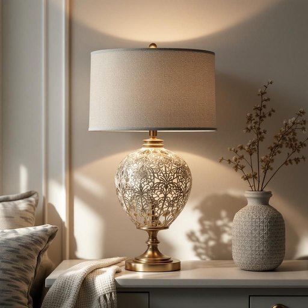

# accessory

<h1 style="font-size: 2.5em; font-weight: 300; letter-spacing: 2px; margin: 0; color: #2c3e50;">
/ækˈsɛsəri/
</h1>

---

---

## 例句

Although the new lamp was elegant on its own, we decided to purchase a matching accessory, such as a decorative lampshade with intricate patterns and subtle colours, to complement the living room’s overall aesthetic and create a more inviting atmosphere for when guests visit.

*Although(/ˌɔlˈðoʊ/) the(/ðə/) new(/nu/) lamp(/læmp/) was(/wɑz/) elegant(/ˈɛləgənt/) on(/ɔn/) its(/ɪts/) own,(/oʊn,/) we(/wi/) decided(/ˌdɪˈsaɪdɪd/) to(/tɪ/) purchase(/ˈpərʧəs/) a(/ə/) matching(/ˈmæʧɪŋ/) accessory,(/ækˈsɛsəri,/) such(/səʧ/) as(/ɛz/) a(/ə/) decorative(/ˈdɛkrətɪv/) lampshade(/lampshade*/) with(/wɪθ/) intricate(/ˈɪntrəkət/) patterns(/ˈpætərnz/) and(/ənd/) subtle(/ˈsətəl/) colours,(/colours*,/) to(/tɪ/) complement(/ˈkɑmpləmənt/) the(/ðə/) living(/ˈlɪvɪŋ/) room’s(/room’s*/) overall(/ˈoʊvərˌɔl/) aesthetic(/ɛsˈθɛtɪk/) and(/ənd/) create(/kriˈeɪt/) a(/ə/) more(/mɔr/) inviting(/ˌɪnˈvaɪtɪŋ/) atmosphere(/ˈætməsˌfɪr/) for(/fər/) when(/wɪn/) guests(/gɛsts/) visit.(/ˈvɪzɪt./)*

**翻译：** 尽管这盏新灯本身已颇具雅致，我们仍决定购置一款相配的饰品，比如带有精致图案和淡雅色彩的装饰灯罩，以此补充客厅整体美感，营造更加温馨宜人的氛围，迎接来访的宾客。

---

## 解释

在家居生活用品场景中，作为名词的“accessory”通常指辅助手段或附属品，具体使用场合包括家具的装饰配件如靠垫、装饰灯具、窗帘挂钩，厨房用具的附加工具如搅拌机的配件或浴室用品的小物件如牙刷架、肥皂盒等。这些“accessories”不是必需品，但能增加功能性或美观性。英语学习者在使用该词时应注意，“accessory”作为可数名词时需与冠词连用或复数形式“accessories”，且常与表示类别的名词搭配，如“home accessories”、“kitchen accessories”等。此外，该词在法律或犯罪语境中也有“共犯”含义，但在家居用品语境中无贬义，语气中性偏实用。词源上，“accessory”源自拉丁语“accessorius”，意指“附加的，补充的”，反映其辅助性和附属性特质。在中文语境中，“accessory”准确翻译为“配件”或“附属品”，强调其非核心但有助于美化或完善使用体验的角色，避免误解为“主要物品”或“必需品”，是对家居用品进行细节补充和功能扩展的重要组成部分。

---

<small style="color: #999; font-size: 0.9em;">2025-07-27 09:14:04</small>

