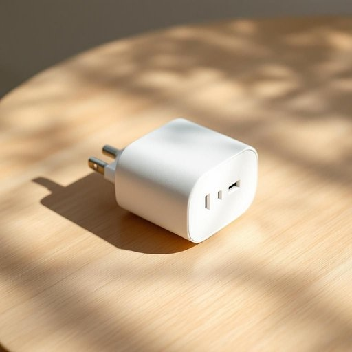

# adapter

<h1 style="font-size: 2.5em; font-weight: 300; letter-spacing: 2px; margin: 0; color: #2c3e50;">
/əˈdæptər/
</h1>

---

---

## 例句

After observing the intricate patterns on the ancient tapestry, I realized that the charger wouldn’t fit into the socket, so I had to rummage through the drawer for ages before finally finding the adapter that not only converts the plug shape but also stabilises the voltage, which is crucial for safely using foreign electronics in our old-fashioned British wiring system.

*After(/ˈæftər/) observing(/əbˈzərvɪŋ/) the(/ðə/) intricate(/ˈɪntrəkət/) patterns(/ˈpætərnz/) on(/ɔn/) the(/ðə/) ancient(/ˈeɪnʧənt/) tapestry,(/ˈtæpəstri,/) I(/aɪ/) realized(/ˈriəˌlaɪzd/) that(/ðət/) the(/ðə/) charger(/ˈʧɑrʤər/) wouldn’t(/wouldn’t*/) fit(/fɪt/) into(/ˈɪntu/) the(/ðə/) socket,(/ˈsɑkət,/) so(/soʊ/) I(/aɪ/) had(/hæd/) to(/tɪ/) rummage(/ˈrəmɪʤ/) through(/θru/) the(/ðə/) drawer(/drɔr/) for(/fər/) ages(/ˈeɪʤɪz/) before(/ˌbiˈfɔr/) finally(/ˈfaɪnəli/) finding(/ˈfaɪndɪŋ/) the(/ðə/) adapter(/əˈdæptər/) that(/ðət/) not(/nɑt/) only(/ˈoʊnli/) converts(/ˈkɑnvərts/) the(/ðə/) plug(/pləg/) shape(/ʃeɪp/) but(/bət/) also(/ˈɔlsoʊ/) stabilises(/stabilises*/) the(/ðə/) voltage,(/ˈvoʊltɪʤ,/) which(/wɪʧ/) is(/ɪz/) crucial(/ˈkruʃəl/) for(/fər/) safely(/ˈseɪfli/) using(/ˈjuzɪŋ/) foreign(/ˈfɔrən/) electronics(/ˌɪˌlɛkˈtrɑnɪks/) in(/ɪn/) our(/ɑr/) old-fashioned(/ˌoʊldˈfæʃənd/) British(/ˈbrɪtɪʃ/) wiring(/ˈwaɪrɪŋ/) system.(/ˈsɪstəm./)*

**翻译：** 在细细观察那幅古老挂毯上错综复杂的图案后，我才意识到充电器无法插入插座，于是不得不在抽屉里翻了很久，最终才找到那个既能转换插头形状又能稳定电压的转换器，这对在我们这老式英国电路系统中安全使用国外电子设备至关重要。

---

## 解释

adapter作为名词在家居生活用品场景中，通常指用于连接或转换不同设备接口或电源，以实现兼容或正常工作的装置，例如电源适配器、插头转换器等。使用时常见语境包括power adapter（电源适配器）、plug adapter（插头转换器）等，适用于电子设备充电、家用电器接入不同规格电源等情况。英语学习者应注意adapter是可数名词，常与限定词连用，如a/an adapter, the adapter，且常与介词短语搭配，如adapter for sth（用于某物的适配器）。此外，power adapter或adapter plug是常见的固定搭配。词源上，adapter源自动词adapt（适应、调整）加上表示人的或物的名词后缀-er，本义即使适应的东西或人，带有功能性和工具性的含义。在中文语境中，adapter一般准确翻译为适配器或转换器，指能够使设备或接口相互兼容的装置，无贬义，属于中性词汇。需要注意的是，该词在使用中侧重于适应或转换功能，区别于纯粹的插头或充电器，强调的是连接和转换的工具角色，体现了现代家庭中多样化电子产品兼容使用的需求。

---

<small style="color: #999; font-size: 0.9em;">2025-07-27 09:14:04</small>

