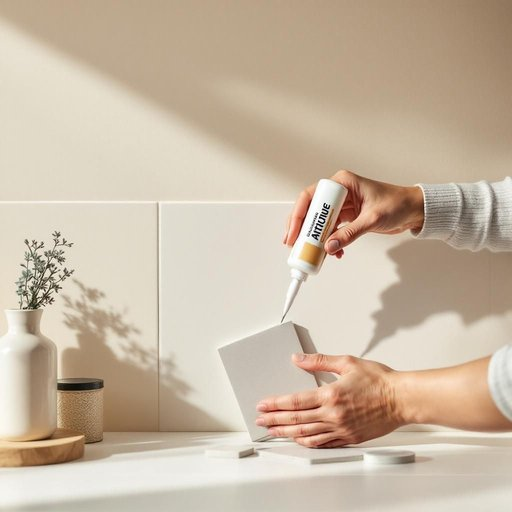

# adhesive

<h1 style="font-size: 2.5em; font-weight: 300; letter-spacing: 2px; margin: 0; color: #2c3e50;">
/əˈdhisɪv/
</h1>

---

---

## 例句

Before you start fixing the loose tiles in the kitchen, ensure that the adhesive you select possesses not only sufficient strength to resist moisture but also compatibility with the surface type, since the wrong adhesive might cause the repair to fail prematurely.

*Before(/ˌbiˈfɔr/) you(/ju/) start(/stɑrt/) fixing(/ˈfɪksɪŋ/) the(/ðə/) loose(/lus/) tiles(/taɪlz/) in(/ɪn/) the(/ðə/) kitchen,(/ˈkɪʧən,/) ensure(/ɪnˈʃʊr/) that(/ðət/) the(/ðə/) adhesive(/əˈdhisɪv/) you(/ju/) select(/səˈlɛkt/) possesses(/pəˈzɛsɪz/) not(/nɑt/) only(/ˈoʊnli/) sufficient(/səˈfɪʃənt/) strength(/strɛŋθ/) to(/tɪ/) resist(/rɪˈzɪst/) moisture(/ˈmɔɪsʧər/) but(/bət/) also(/ˈɔlsoʊ/) compatibility(/kəmˌpætəˈbɪləˌti/) with(/wɪθ/) the(/ðə/) surface(/ˈsərfəs/) type,(/taɪp,/) since(/sɪns/) the(/ðə/) wrong(/rɔŋ/) adhesive(/əˈdhisɪv/) might(/maɪt/) cause(/kɔz/) the(/ðə/) repair(/rɪˈpɛr/) to(/tɪ/) fail(/feɪl/) prematurely.(/ˌpriməˈʧʊrli./)*

**翻译：** 在开始修复厨房中松动的瓷砖之前，请确保所选用的粘合剂不仅具有足够的抗潮强度，还要与瓷砖表面材质相匹配，因为一旦选错粘合剂，修复工作可能会提前失败。

---

## 解释

“adhesive”作为名词在家居生活用品的语境中，通常指的是用于粘合物体的胶水或粘合剂，如胶带、强力胶等，广泛用于固定、修补和制作手工艺品等具体场合。英语学习者需要注意“adhesive”作为可数名词时常用复数“adhesives”表示多种类型的粘合剂，且一般搭配动词如“apply”（涂抹）、“use”（使用）、“stick”（粘贴）等，常见表达还有“adhesive tape”（胶带）、“adhesive label”（不干胶标签），语法上它既可用作形容词，也可作名词，需根据句子结构区分。词源来自拉丁语“adhaesivus”，由“ad-”（表示“向，附加”）与“haerere”（意为“粘附”）构成，体现了其粘附性的本质。在中文语境中，“adhesive”作为名词最准确的翻译是“粘合剂”或“胶粘剂”，强调其使物体粘合的功能，常对应市面上的各种胶水、贴纸胶等产品。该词本身无褒贬含义，属于中性术语，在不同产品说明或家庭使用说明中均较为正式和常见，无特殊文化色彩。

---

<small style="color: #999; font-size: 0.9em;">2025-07-27 09:14:04</small>

