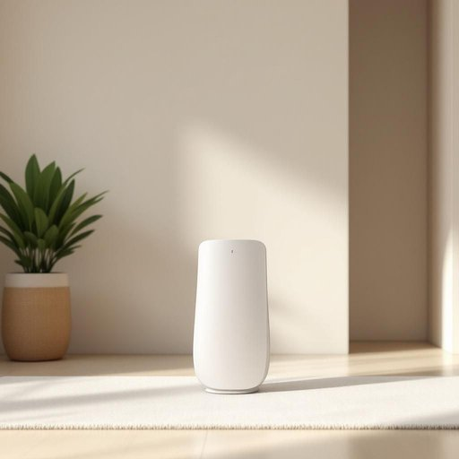

# antenna

<h1 style="font-size: 2.5em; font-weight: 300; letter-spacing: 2px; margin: 0; color: #2c3e50;">
/ænˈtɛnə/
</h1>

---

---

## 例句

Despite the heavy rain and the chaotic streets, the firefighter’s resilience and commitment to saving lives never wavered as he navigated through debris to reach the trapped family in the burning building.

*Despite(/dɪˈspaɪt/) the(/ðə/) heavy(/ˈhɛvi/) rain(/reɪn/) and(/ənd/) the(/ðə/) chaotic(/keɪˈɑtɪk/) streets,(/strits,/) the(/ðə/) firefighter’s(/firefighter’s*/) resilience(/rɪˈzɪljəns/) and(/ənd/) commitment(/kəˈmɪtmənt/) to(/tɪ/) saving(/ˈseɪvɪŋ/) lives(/lɪvz/) never(/ˈnɛvər/) wavered(/ˈweɪvərd/) as(/ɛz/) he(/hi/) navigated(/ˈnævəˌgeɪtɪd/) through(/θru/) debris(/dəˈbri/) to(/tɪ/) reach(/riʧ/) the(/ðə/) trapped(/træpt/) family(/ˈfæməli/) in(/ɪn/) the(/ðə/) burning(/ˈbərnɪŋ/) building.(/ˈbɪldɪŋ./)*

**翻译：** 尽管暴雨如注、街道混乱，那位消防员在穿越瓦砾救援被困火场中的家庭时，坚韧不拔、救人心切的精神始终未曾动摇。

---

## 解释

英语单词“antenna”作为名词，在家居生活用品的语境中通常指的是用于接收无线电信号的天线，常见于电视、收音机、无线网络设备等家用电子产品上。具体使用场合多为描述这些设备的接收器结构，如“television antenna”（电视天线）、“Wi-Fi antenna”（无线网络天线）等。英语学习者在使用时应注意“antenna”作为可数名词，复数形式为“antennas”，但在生物学领域中对应昆虫的触角时，复数通常用“antennae”。在家居电子设备环境中，多采用“antennas”形式。此外，常见搭配有“extend the antenna”（拉长天线）、“adjust the antenna”（调整天线）、“external/internal antenna”（外置/内置天线）等，表达时需结合具体动作和设备功能。该词源自拉丁语“antenna”，原意为“桅杆上的桁杆”，后来借指细长的感应装置。中文中，准确翻译为“天线”，强调其作为信号接收或发送装置的功能，避免将其与昆虫的“触角”混淆。“天线”一词在中文语境中中性无褒贬含义，主要用于技术设备描述，无特殊文化内涵，但作为技术名词时需根据具体设备类型灵活解释。整体来看，“antenna”在家居生活用品中的使用清晰明确，是描述电子信号接收器的重要名词，兼具技术性和实用性。

---

<small style="color: #999; font-size: 0.9em;">2025-07-27 09:14:04</small>

