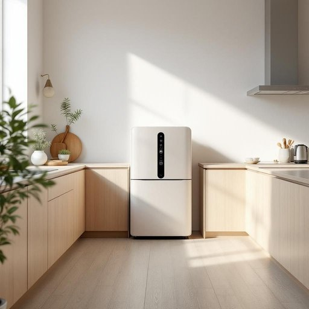

# appliance

<h1 style="font-size: 2.5em; font-weight: 300; letter-spacing: 2px; margin: 0; color: #2c3e50;">
/əˈplaɪəns/
</h1>

---

---

## 例句

Although the kitchen already boasts several modern appliances, such as a state-of-the-art oven and a high-efficiency dishwasher, I've been considering investing in a smart appliance that can not only save energy but also be controlled remotely through an app, thereby enhancing both convenience and sustainability in everyday cooking.

*Although(/ˌɔlˈðoʊ/) the(/ðə/) kitchen(/ˈkɪʧən/) already(/ɔˈrɛdi/) boasts(/boʊsts/) several(/ˈsɛvərəl/) modern(/ˈmɑdərn/) appliances,(/əˈplaɪənsɪz,/) such(/səʧ/) as(/ɛz/) a(/ə/) state-of-the-art(/ˌsteɪtəvðɪˈɑrt/) oven(/ˈəvən/) and(/ənd/) a(/ə/) high-efficiency(/high-efficiency*/) dishwasher,(/ˈdɪʃˌwɑʃər,/) I've(/aɪv/) been(/bɪn/) considering(/kənˈsɪdərɪŋ/) investing(/ˌɪnˈvɛstɪŋ/) in(/ɪn/) a(/ə/) smart(/smɑrt/) appliance(/əˈplaɪəns/) that(/ðət/) can(/kən/) not(/nɑt/) only(/ˈoʊnli/) save(/seɪv/) energy(/ˈɛnərʤi/) but(/bət/) also(/ˈɔlsoʊ/) be(/bi/) controlled(/kənˈtroʊld/) remotely(/riˈmoʊtli/) through(/θru/) an(/ən/) app,(/æp,/) thereby(/ˈðɛrˈbaɪ/) enhancing(/ɛnˈhænsɪŋ/) both(/boʊθ/) convenience(/kənˈvinjəns/) and(/ənd/) sustainability(/səˌsteɪnəˈbɪlɪti/) in(/ɪn/) everyday(/ˈɛvriˈdeɪ/) cooking.(/ˈkʊkɪŋ./)*

**翻译：** 尽管厨房已经配备了多种现代化电器，如先进的烤箱和高效洗碗机，但我一直在考虑投资一款既能节能又可通过手机应用远程控制的智能电器，从而提升日常烹饪的便利性和可持续性。

---

## 解释

英语单词“appliance”在家居生活用品语境中作为名词，主要指用于家庭或厨房中具有特定功能的电器或设备，如冰箱、洗衣机、微波炉等，通常用于描述那些帮助完成家务或生活便利的机械装置。使用时，多见于描述家用电器或设备场合，如“The kitchen appliances are modern and energy-efficient”（厨房电器现代且节能）。学习者需注意其可数名词用法，复数形式为“appliances”，常见的搭配有“household appliances”（家用电器）、“kitchen appliances”（厨房电器）、“electrical appliances”（电器设备）等。此外，appliance通常指较大或固定的设备，不适用于手持小工具。词源方面，appliance源自拉丁语“appliāre”，意为“附加、应用”，后演变为指“附加的设备或用具”，反映其作为辅助工具的身份。中文中，appliance常被准确翻译为“家用电器”或“电器用品”，侧重于日常生活中帮助完成家务劳动的机器，不含褒贬色彩，属中性词汇，且在不同文化中均被广泛接受，表达生活便利和技术进步的含义。

---

<small style="color: #999; font-size: 0.9em;">2025-07-27 09:14:04</small>

