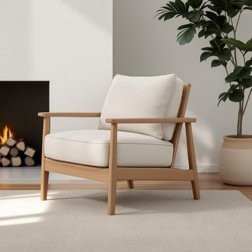

# armchair

<h1 style="font-size: 2.5em; font-weight: 300; letter-spacing: 2px; margin: 0; color: #2c3e50;">
/ˈɑrmˌʧɛr/
</h1>

---

---

## 例句

After a long day at work, nothing beats sinking into the armchair by the fireplace, which, with its plush cushions and sturdy oak frame, not only provides exceptional comfort but also adds a touch of classic elegance to the living room.

*After(/ˈæftər/) a(/ə/) long(/lɔŋ/) day(/deɪ/) at(/æt/) work,(/wərk,/) nothing(/ˈnəθɪŋ/) beats(/bits/) sinking(/ˈsɪŋkɪŋ/) into(/ˈɪntu/) the(/ðə/) armchair(/ˈɑrmˌʧɛr/) by(/baɪ/) the(/ðə/) fireplace,(/ˈfaɪərˌpleɪs,/) which,(/wɪʧ,/) with(/wɪθ/) its(/ɪts/) plush(/pləʃ/) cushions(/ˈkʊʃənz/) and(/ənd/) sturdy(/ˈstərdi/) oak(/oʊk/) frame,(/freɪm,/) not(/nɑt/) only(/ˈoʊnli/) provides(/prəˈvaɪdz/) exceptional(/ɪkˈsɛpʃənəl/) comfort(/ˈkəmfərt/) but(/bət/) also(/ˈɔlsoʊ/) adds(/ædz/) a(/ə/) touch(/təʧ/) of(/əv/) classic(/ˈklæsɪk/) elegance(/ˈɛləgəns/) to(/tɪ/) the(/ðə/) living(/ˈlɪvɪŋ/) room.(/rum./)*

**翻译：** 经过一整天的辛劳，最惬意的莫过于沉浸在壁炉旁的扶手椅中。那张椅子配有柔软的坐垫和坚固的橡木框架，不仅带来极致的舒适感，也为客厅增添了一抹经典的优雅气息。

---

## 解释

“armchair”作为名词在家居生活用品的语境中指的是有扶手的单人软椅通常用于客厅书房等休息或阅读的场所强调舒适性与支撑性适合坐着放松或看书看电视等活动英语学习者在使用该词时应注意其单复数形式分别是“armchair”和“armchairs”且常见搭配有“comfortable armchair”（舒适的扶手椅）“leather armchair”（皮质扶手椅）“armchair in the living room”（客厅里的扶手椅）等表达时也可用“sit in an armchair”描述坐在扶手椅上此外“armchair”有时也构成复合表达如“armchair critic”（袖手旁观的评论者指不切实际的批评者）此时带有贬义暗示缺乏实践经验词源上“armchair”来自中世纪英语结合了“arm”（手臂）和“chair”（椅子）字面意为带扶手的椅子最初强调椅子两侧有支撑手臂的结构便于休息从中文角度看“armchair”准确翻译为“扶手椅”是汉语中常见且明确的家具名称无歧义在实际应用中还可能具体化为“单人扶手椅”或“软扶手椅”以突出其款式和用途总之“armchair”作为家具名词语义明确在日常生活中指代常见的休闲座椅使用时需区分其字面含义与比喻用法避免语境混淆

---

<small style="color: #999; font-size: 0.9em;">2025-07-27 09:14:04</small>

