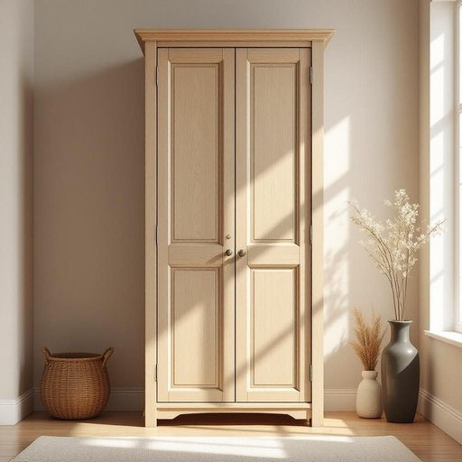

# armoire

<h1 style="font-size: 2.5em; font-weight: 300; letter-spacing: 2px; margin: 0; color: #2c3e50;">
/ˈɑmwɑr/
</h1>

---

---

## 例句

After much deliberation over where to store our winter coats, scarves, and spare blankets without cluttering the hallway, we finally decided to purchase an antique oak armoire, which not only provides ample hanging space and deep shelves but also adds a touch of rustic charm to our living room, seamlessly blending with the existing décor while keeping everything neatly organised.

*After(/ˈæftər/) much(/məʧ/) deliberation(/dɪˌlɪbərˈeɪʃən/) over(/ˈoʊvər/) where(/wɛr/) to(/tɪ/) store(/stɔr/) our(/ɑr/) winter(/ˈwɪntər/) coats,(/koʊts,/) scarves,(/skɑrvz,/) and(/ənd/) spare(/spɛr/) blankets(/ˈblæŋkəts/) without(/wɪˈθaʊt/) cluttering(/ˈklətərɪŋ/) the(/ðə/) hallway,(/ˈhɔlˌweɪ,/) we(/wi/) finally(/ˈfaɪnəli/) decided(/ˌdɪˈsaɪdɪd/) to(/tɪ/) purchase(/ˈpərʧəs/) an(/ən/) antique(/ænˈtik/) oak(/oʊk/) armoire,(/ˈɑmwɑr,/) which(/wɪʧ/) not(/nɑt/) only(/ˈoʊnli/) provides(/prəˈvaɪdz/) ample(/ˈæmpəl/) hanging(/ˈhæŋɪŋ/) space(/speɪs/) and(/ənd/) deep(/dip/) shelves(/ʃɛlvz/) but(/bət/) also(/ˈɔlsoʊ/) adds(/ædz/) a(/ə/) touch(/təʧ/) of(/əv/) rustic(/ˈrəstɪk/) charm(/ʧɑrm/) to(/tɪ/) our(/ɑr/) living(/ˈlɪvɪŋ/) room,(/rum,/) seamlessly(/ˈsimləsli/) blending(/ˈblɛndɪŋ/) with(/wɪθ/) the(/ðə/) existing(/ɪgˈzɪstɪŋ/) décor(/décor*/) while(/waɪl/) keeping(/ˈkipɪŋ/) everything(/ˈɛvriˌθɪŋ/) neatly(/ˈnitli/) organised.(/organised*./)*

**翻译：** 经过多次商讨，关于如何存放我们的冬季大衣、围巾和备用毯子而不使走廊显得杂乱，我们最终决定购置一只古董橡木衣橱。它不仅拥有充足的挂衣空间和深邃的搁板，还为客厅增添了一抹质朴的韵味，完美融入现有的装饰风格，同时保持一切井然有序。

---

## 解释

“armoire”作为名词在家居生活用品的语境中，指一种大型的、通常是高而宽、带门的储藏柜，主要用来存放衣物、床上用品或其他家居用品，常见于卧室或更衣室，具体使用场合通常涉及家具描述、家居布置或购物场景，如“a wooden armoire in the bedroom”（卧室里的木制衣柜），英语学习者需要注意，“armoire”是一个法语借词，发音通常为/ˌɑːrmˈwɑːr/，在语法上作为可数名词使用，单数为“armoire”，复数形式为“armoires”，常见搭配有“antique armoire”（古董衣柜）、“large armoire”（大衣柜）、“oak armoire”（橡木衣柜）等，此外，因其通常指带门的独立储物柜，与closet（壁橱）不同，后者更多指固定结构，词源上，“armoire”源自古法语，意为“武器柜”，原指存放武器的柜子，后来引申为储藏衣物的家具，体现了家具功能的演变，在中文语境中，“armoire”多准确翻译为“衣柜”或“衣橱”，特指那种立式、带门且较为宽大的衣物储藏家具，区别于“壁橱”或“衣架”之类更小或开敞式的存储工具，该词通常不带有褒贬色彩，但因其法语来源及传统设计，常被视为较为典雅或古典的家具款式，具有一定文化审美价值。

---

<small style="color: #999; font-size: 0.9em;">2025-07-27 09:14:04</small>

