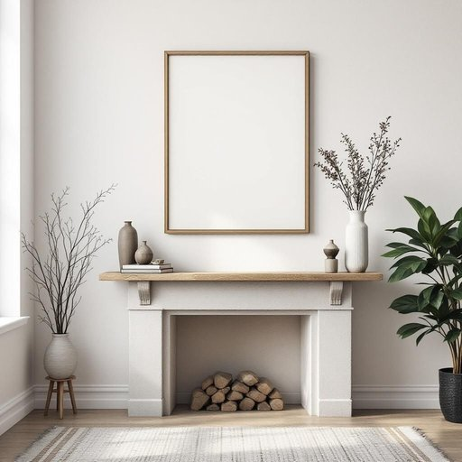

# artwork

<h1 style="font-size: 2.5em; font-weight: 300; letter-spacing: 2px; margin: 0; color: #2c3e50;">
/ˈɑrtˌwərk/
</h1>

---

---

## 例句

Although I finally decided to hang the artwork above the fireplace, its delicate frame and vivid colours complement the rustic wooden mantelpiece and the array of vintage ornaments we’ve collected over the years, adding a touch of sophistication to the living room’s otherwise homely atmosphere.

*Although(/ˌɔlˈðoʊ/) I(/aɪ/) finally(/ˈfaɪnəli/) decided(/ˌdɪˈsaɪdɪd/) to(/tɪ/) hang(/hæŋ/) the(/ðə/) artwork(/ˈɑrtˌwərk/) above(/əˈbəv/) the(/ðə/) fireplace,(/ˈfaɪərˌpleɪs,/) its(/ɪts/) delicate(/ˈdɛləkət/) frame(/freɪm/) and(/ənd/) vivid(/ˈvɪvɪd/) colours(/colours*/) complement(/ˈkɑmpləmənt/) the(/ðə/) rustic(/ˈrəstɪk/) wooden(/ˈwʊdən/) mantelpiece(/mantelpiece*/) and(/ənd/) the(/ðə/) array(/əreɪ/) of(/əv/) vintage(/ˈvɪntɪʤ/) ornaments(/ˈɔrnəmənts/) we’ve(/we’ve*/) collected(/kəˈlɛktəd/) over(/ˈoʊvər/) the(/ðə/) years,(/jɪrz,/) adding(/ˈædɪŋ/) a(/ə/) touch(/təʧ/) of(/əv/) sophistication(/səˌfɪstəˈkeɪʃən/) to(/tɪ/) the(/ðə/) living(/ˈlɪvɪŋ/) room’s(/room’s*/) otherwise(/ˈəðərˌwaɪz/) homely(/ˈhoʊmli/) atmosphere.(/ˈætməsˌfɪr./)*

**翻译：** 请按照以下格式要求格式化结果，只返回格式化后的内容，不要包含任何解释、思考过程或额外标记。请执行以下清理操作：1. 移除所有<think>...</think>标签及其内容2. 移除所有[Ignore this...]标记3. 如果存在JSON格式要求，确保输出符合要求4. 移除\boxed{...}的标记，保留内容5. 清理多余空白和换行6. 按照格式要求排版和格式化7. 不要添加任何解释或元信息8. 对于输入的重要信息，输出为一整个段落，不要输出markdown内容，也不要输出bullet points，不要增加信息，也不要删除信息。格式要求：格式要求简短描述：仅输出翻译文本内容，不包含额外信息，保持准确、地道和优美的表达。格式示例：虽然我最终决定将这幅艺术品挂在壁炉上方，但其精致的框架和鲜艳的色彩与质朴的木制壁炉架以及我们多年来收集的各式复古装饰品相得益彰，为客厅原本温馨的氛围增添了一抹雅致。

---

## 解释

英语单词“artwork”在家居生活用品的语境中作为名词，通常指用于装饰家居环境的艺术作品或图案设计，例如挂画、装饰画、印花图案或墙贴等，具体使用场合多涉及描述室内装饰品、家具表面设计、包装上的艺术图案等。学习者在使用该词时需注意，“artwork”是不可数名词，但在特定情境下也可以指一件具体的艺术作品，常用的搭配有“original artwork”（原创艺术品）、“digital artwork”（数字艺术作品）、“display artwork”（展示艺术品）等表达，且通常用作单数。语法上，它多作为主语、宾语或定语出现，且不可用复数形式“artworks”表示一般意义下的艺术作品，但在某些专业场合可见复数形式，表示多件艺术品。词源上，“artwork”由“art”（艺术）和“work”（作品、劳动）组合而成，最早用来指艺术家创作出的视觉作品，后来延伸至各种与艺术设计相关的图形和成品，尤其在印刷、设计领域中广泛使用。中文翻译常为“艺术品”、“艺术作品”或“艺术设计图案”，结合家居生活语境多指“装饰画”、“艺术装饰图案”或“艺术作品”，强调物品不仅是实用家具，更带有审美和文化价值。在中文语境中，它通常无褒贬色彩，属中性词，但因其关联艺术和美学，常带有一定的美学价值认可。需要注意的是，在家居用品领域提及“artwork”时，往往侧重于视觉设计和装饰功能，而非纯粹的艺术收藏意义。

---

<small style="color: #999; font-size: 0.9em;">2025-07-27 09:14:04</small>

