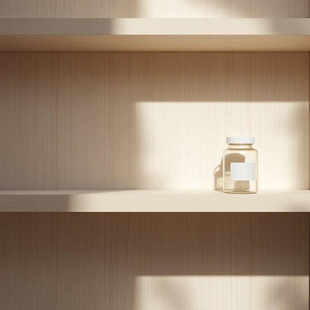

# aspirin

<h1 style="font-size: 2.5em; font-weight: 300; letter-spacing: 2px; margin: 0; color: #2c3e50;">
/ˈæsprɪn/
</h1>

---

---

## 例句

Could you please check if there’s any aspirin left in the medicine cabinet, as I’ve been having this persistent headache since this morning and, given that it's the only painkiller I seem to tolerate well, I’d rather not take anything stronger without asking the doctor first?

*Could(/kʊd/) you(/ju/) please(/pliz/) check(/ʧɛk/) if(/ɪf/) there’s(/there’s*/) any(/ˈɛni/) aspirin(/ˈæsprɪn/) left(/lɛft/) in(/ɪn/) the(/ðə/) medicine(/ˈmɛdəsən/) cabinet,(/ˈkæbənət,/) as(/ɛz/) I’ve(/i’ve*/) been(/bɪn/) having(/ˈhævɪŋ/) this(/ðɪs/) persistent(/pərˈsɪstənt/) headache(/ˈhɛˌdeɪk/) since(/sɪns/) this(/ðɪs/) morning(/ˈmɔrnɪŋ/) and,(/ənd,/) given(/ˈgɪvɪn/) that(/ðət/) it's(/ɪts/) the(/ðə/) only(/ˈoʊnli/) painkiller(/ˈpeɪnˌkɪlər/) I(/aɪ/) seem(/sim/) to(/tɪ/) tolerate(/ˈtɑlərˌeɪt/) well,(/wɛl,/) I’d(/i’d*/) rather(/ˈrəðər/) not(/nɑt/) take(/teɪk/) anything(/ˈɛniˌθɪŋ/) stronger(/ˈstrɔŋgər/) without(/wɪˈθaʊt/) asking(/ˈæskɪŋ/) the(/ðə/) doctor(/ˈdɔktər/) first?(/fərst?/)*

**翻译：** 请您帮忙看看药柜里还有阿司匹林吗？我从今天早上开始一直头痛，而且阿司匹林是我唯一能较好耐受的止痛药，所以我宁愿先不服用其他更强效的药物，最好先咨询一下医生。

---

## 解释

单词“aspirin”作为名词，通常指家居生活中常见的解热镇痛药，即阿司匹林，主要用于缓解头痛、发热、炎症以及预防心血管疾病。在具体使用场合和语境中，aspirin常出现在描述感冒、头痛或日常医药用品时，如“take aspirin for a headache”（吃阿司匹林治疗头痛）或“keep some aspirin in the medicine cabinet”（药柜里放些阿司匹林）。英语学习者使用该词时应注意，aspirin是不可数名词，表示的是药物整体概念，通常不用于复数形式，但在某些非正式语境下可以见到“aspirins”指不同剂量或片数；此外，常见的搭配有“low-dose aspirin”（小剂量阿司匹林）、“aspirin tablet”（阿司匹林片）等，表达时多用take aspirin、give someone aspirin等动词搭配，注意与剂量和服用方式相关的介词使用。词源方面，“aspirin”最初源自德国拜耳公司对水杨酸乙酯化合成的商品名，名称结合了“a”代表乙酰基（acetyl）和“spir”来自植物“meadowsweet”（又称spirea，即用来提取水杨酸的植物）的拉丁名spiræa，后被广泛接受为该药物的通用名。中文语境中，“aspirin”准确翻译为“阿司匹林”，是一种常用且安全性较高的非处方药品，具有明确的药理作用和应用范围，没有褒贬色彩，但需注意因其具有抗凝血作用，某些人群（如出血倾向患者）应谨慎使用。总体而言，aspirin在家居生活用品中代表一种常备药物，英语学习者需理解其医学功能及正确用法，以免误用。

---

<small style="color: #999; font-size: 0.9em;">2025-07-27 09:14:04</small>

