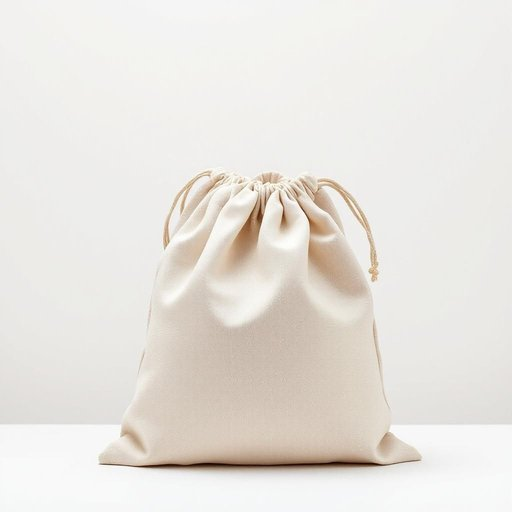

# bag

<h1 style="font-size: 2.5em; font-weight: 300; letter-spacing: 2px; margin: 0; color: #2c3e50;">
/bæg/
</h1>

---

---

## 例句

Although the blueprint seemed complete, the engineer realized that some crucial measurements were missing from the draft, which could potentially jeopardize the entire construction project if left uncorrected before the final submission.

*Although(/ˌɔlˈðoʊ/) the(/ðə/) blueprint(/ˈbluˌprɪnt/) seemed(/simd/) complete,(/kəmˈplit,/) the(/ðə/) engineer(/ˈɛnʤəˈnɪr/) realized(/ˈriəˌlaɪzd/) that(/ðət/) some(/səm/) crucial(/ˈkruʃəl/) measurements(/ˈmɛʒərmənts/) were(/wər/) missing(/ˈmɪsɪŋ/) from(/frəm/) the(/ðə/) draft,(/dræft,/) which(/wɪʧ/) could(/kʊd/) potentially(/pəˈtɛnʃəli/) jeopardize(/ˈʤɛpərˌdaɪz/) the(/ðə/) entire(/ɪnˈtaɪər/) construction(/kənˈstrəkʃən/) project(/ˈprɑʤɛkt/) if(/ɪf/) left(/lɛft/) uncorrected(/ˌənkərˈɛktɪd/) before(/ˌbiˈfɔr/) the(/ðə/) final(/ˈfaɪnəl/) submission.(/səbˈmɪʃən./)*

**翻译：** 尽管蓝图看似完整，工程师却意识到草图中缺少一些关键的尺寸，如果在最终提交前不加修正，可能会危及整个建筑项目。

---

## 解释

英语单词“bag”作为名词，在家居生活用品的语境中，通常指的是用来盛装、携带物品的袋子，如塑料袋、购物袋、手提袋或收纳袋等，常见于购买食品、存放杂物或整理家居环境时使用。具体使用场合如购物时提物品、厨房中存放食材、卧室或书房中整理小物件等。英语学习者在使用“bag”时需注意其可数名词性质，一般可用复数形式“bags”，且可搭配形容词或修饰词，如“plastic bag”（塑料袋）、“shopping bag”（购物袋）、“paper bag”（纸袋）等；在表达时，“bag of”结构也较常见，如“一袋米”（a bag of rice），须与所装物品搭配使用，避免出现表达不当。此外，“bag”在某些口语表达中还有捕获、获得的比喻义，但在家居用品语境中需避免混淆。词源上，“bag”源自中古英语“bagge”，可能起源于北欧语言，意指用皮革或布料制成的容器。中文语境中，“bag”通常准确翻译为“袋子”或“包”，对应的是家居生活中常见的日常存储或携带用具，理解时应结合具体材质和用途选择合适词汇，如“袋子”、“手提袋”、“书包”等。该词本身无褒贬意义，使用广泛且中性，反映了日常生活中的实用物品，但需根据语境避免与其他含义混淆。

---

<small style="color: #999; font-size: 0.9em;">2025-07-27 09:14:04</small>

