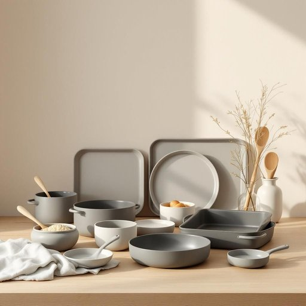

# bakeware

<h1 style="font-size: 2.5em; font-weight: 300; letter-spacing: 2px; margin: 0; color: #2c3e50;">
/ˈbeɪkˌwɛr/
</h1>

---

---

## 例句

After rummaging through the cluttered cupboard where she usually kept her baking essentials, she finally found the set of non-stick bakeware, including a variety of tins and trays, which not only made preparing the birthday cake much easier but also ensured it baked evenly without sticking to the surfaces.

*After(/ˈæftər/) rummaging(/ˈrəmɪʤɪŋ/) through(/θru/) the(/ðə/) cluttered(/ˈklətərd/) cupboard(/ˈkəbərd/) where(/wɛr/) she(/ʃi/) usually(/ˈjuʒəwəli/) kept(/kɛpt/) her(/hər/) baking(/ˈbeɪkɪŋ/) essentials,(/ɛˈsɛnʃəlz,/) she(/ʃi/) finally(/ˈfaɪnəli/) found(/faʊnd/) the(/ðə/) set(/sɛt/) of(/əv/) non-stick(/nɑnˈstɪk/) bakeware,(/ˈbeɪkˌwɛr,/) including(/ˌɪnˈkludɪŋ/) a(/ə/) variety(/vərˈaɪəti/) of(/əv/) tins(/tɪnz/) and(/ənd/) trays,(/treɪz,/) which(/wɪʧ/) not(/nɑt/) only(/ˈoʊnli/) made(/meɪd/) preparing(/pərˈpɛrɪŋ/) the(/ðə/) birthday(/ˈbərθˌdeɪ/) cake(/keɪk/) much(/məʧ/) easier(/ˈiziər/) but(/bət/) also(/ˈɔlsoʊ/) ensured(/ɪnˈʃʊrd/) it(/ɪt/) baked(/beɪkt/) evenly(/ˈivənli/) without(/wɪˈθaʊt/) sticking(/ˈstɪkɪŋ/) to(/tɪ/) the(/ðə/) surfaces.(/ˈsərfəsɪz./)*

**翻译：** 在翻找她平时存放烘焙必需品的杂乱橱柜后，她终于找到了那套不粘烤具，包括各种蛋糕模和烤盘，这不仅使制作生日蛋糕变得更加轻松，也保证了蛋糕均匀烘烤且不粘底。

---

## 解释

英语单词“bakeware”作为名词，指的是用于烘焙过程中的各种器具和用具，主要包括烤盘、烤模、烤碗等。这类器具通常由耐高温材料制成，如金属、陶瓷或玻璃，适合在烤箱中使用，常见于家庭烘焙、糕点制作及厨房日常生活场景中。英语学习者在使用“bakeware”时需要注意它是不可数名词，通常不直接加复数形式，而是用集合意义表达“各种烘焙器具”，如“a set of bakeware”。常见搭配有“bakeware set”（烘焙器具套装）、“non-stick bakeware”（不粘烤盘）、“ceramic bakeware”（陶瓷烤具）等，学习时可通过这些固定表达熟悉其语境。词源上，“bakeware”由“bake”（烘烤）和“ware”（器具、用品）合成，反映其用途和属性，传达了专门用于烤制食物的器皿含义。在中文语境中应准确翻译为“烘焙用具”或“烤盘器皿”，避免泛指一般厨房器皿，突出其烤制食物的专用性。在文化层面，“bakeware”多带有家庭烘焙、手工制作美食的温馨生活色彩，不包含褒贬义，但体现了现代人对健康饮食和自制食品的重视，是体现厨艺细节的关键词汇。

---

<small style="color: #999; font-size: 0.9em;">2025-07-27 09:14:04</small>

