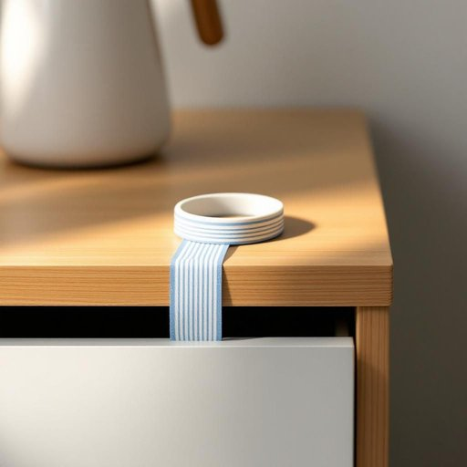

# band

<h1 style="font-size: 2.5em; font-weight: 300; letter-spacing: 2px; margin: 0; color: #2c3e50;">
/bænd/
</h1>

---

---

## 例句

Could you please pass me the rubber band that’s usually kept in the drawer next to the kettle, the one with the faint blue stripe around it, because I need to secure these cables together before I pack them away?

*Could(/kʊd/) you(/ju/) please(/pliz/) pass(/pæs/) me(/mi/) the(/ðə/) rubber(/ˈrəbər/) band(/bænd/) that’s(/that’s*/) usually(/ˈjuʒəwəli/) kept(/kɛpt/) in(/ɪn/) the(/ðə/) drawer(/drɔr/) next(/nɛkst/) to(/tɪ/) the(/ðə/) kettle,(/ˈkɛtəl,/) the(/ðə/) one(/wən/) with(/wɪθ/) the(/ðə/) faint(/feɪnt/) blue(/blu/) stripe(/straɪp/) around(/əraʊnd/) it,(/ɪt,/) because(/bɪˈkəz/) I(/aɪ/) need(/nid/) to(/tɪ/) secure(/sɪˈkjʊr/) these(/ðiz/) cables(/ˈkeɪbəlz/) together(/təˈgɛðər/) before(/ˌbiˈfɔr/) I(/aɪ/) pack(/pæk/) them(/ðɛm/) away?(/əˈweɪ?/)*

**翻译：** 请帮我递一下通常放在水壶旁边抽屉里的那条橡皮筋，就是带有淡蓝色细条纹的那条，因为我需要先把这些线捆好再收拾。

---

## 解释

英语单词“band”在家居生活用品场景中作为名词通常指“带子”、“箍”或“束带”，例如用来捆绑、固定或装饰物品的弹性带、橡胶圈或布带。具体使用场合可能包括包装物品时用的塑料或橡胶带，家具或者电器上的固定带，以及围绕瓶口或盒子的装饰带等。在语法上，“band”作可数名词使用，常见搭配有“rubber band”（橡皮筋）、“elastic band”（弹性带）、“band of fabric”（布带）、“band around”（环绕带），这些短语帮助学习者明确其具体含义及用途。使用时需注意其复数形式“bands”，且该词本身没有数字量词限制，通常与具体物品搭配更具语义明确性。词源方面，“band”来源于古英语“bænd”，意指绑扎物或绑带，起初指的是用来捆绑或固定的织物带，随着时间演变其范围拓展到各种带状物。中文语境中，“band”在家居用品领域准确翻译为“带子”、“束带”、“箍”等，强调其作为一种用于固定或装饰的细长材料，其含义中性，无褒贬色彩，但根据具体搭配有时暗示实用性或装饰性，故在理解时应结合具体语境。总的来说，“band”在家居生活用品的语境中是一个基础且常用的名词，有助于表达各种带状工具的功能和性质。

---

<small style="color: #999; font-size: 0.9em;">2025-07-27 09:14:04</small>

