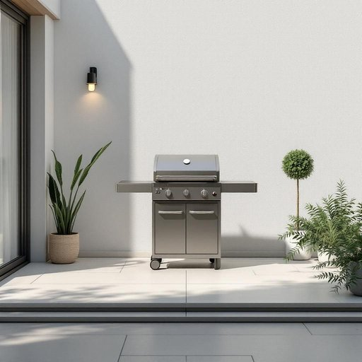

# barbecue

<h1 style="font-size: 2.5em; font-weight: 300; letter-spacing: 2px; margin: 0; color: #2c3e50;">
/ˈbɑrbɪˌkju/
</h1>

---

---

## 例句

Every summer, the barbecue becomes the centerpiece of our family gatherings, where, despite taking up quite a bit of space on the patio and requiring a fair amount of cleaning after each use, stories are shared, kids run around playing, and everyone enjoys freshly grilled food under the warm evening sky.

*Every(/ˈɛvəri/) summer,(/ˈsəmər,/) the(/ðə/) barbecue(/ˈbɑrbɪˌkju/) becomes(/bɪˈkəmz/) the(/ðə/) centerpiece(/ˈsɛntərˌpis/) of(/əv/) our(/ɑr/) family(/ˈfæməli/) gatherings,(/ˈgæðərɪŋz,/) where,(/wɛr,/) despite(/dɪˈspaɪt/) taking(/ˈteɪkɪŋ/) up(/əp/) quite(/kwaɪt/) a(/ə/) bit(/bɪt/) of(/əv/) space(/speɪs/) on(/ɔn/) the(/ðə/) patio(/ˈpætiˌoʊ/) and(/ənd/) requiring(/rikˈwaɪərɪŋ/) a(/ə/) fair(/fɛr/) amount(/əˈmaʊnt/) of(/əv/) cleaning(/ˈklinɪŋ/) after(/ˈæftər/) each(/iʧ/) use,(/juz,/) stories(/ˈstɔriz/) are(/ər/) shared,(/ʃɛrd,/) kids(/kɪdz/) run(/rən/) around(/əraʊnd/) playing,(/pleɪɪŋ,/) and(/ənd/) everyone(/ˈɛvriˌwən/) enjoys(/ˌɛnˈʤɔɪz/) freshly(/ˈfrɛʃli/) grilled(/grɪld/) food(/fud/) under(/ˈəndər/) the(/ðə/) warm(/wɔrm/) evening(/ˈivnɪŋ/) sky.(/skaɪ./)*

**翻译：** 每到夏天，烧烤便成为我们家庭聚会的核心。尽管它占据了露台上相当大的空间，而且每次使用后都需要费不少力气清理，但大家在这里分享故事，孩子们嬉戏奔跑，所有人在温暖的夜空下享受着刚刚烤好的美食。

---

## 解释

英语单词“barbecue”作为名词，在家居生活用品的语境中通常指用于户外烧烤的器具，如烤架、烧烤炉或烧烤设备，常见于家庭庭院、露台或花园，适合朋友聚会或家庭聚餐时使用。英语学习者使用“barbecue”时需注意其词性转换，作为名词时可表示烧烤活动本身或用于烧烤的器具，且在表达时常与动词“have”、“hold”搭配，如“have a barbecue”指举行烧烤活动。此外，“barbecue”作为不可数名词时通常指烧烤食物整体，作为可数名词时则指具体的烧烤设备。该词源自西班牙语“barbacoa”，最初指一种美洲土著的烹饪方式，即将食物放在架子上在火上烤制，后来引入英语并演变成现在的含义。在中文语境中，“barbecue”通常被准确译为“烧烤”或“烧烤架”，根据具体语境确定，是描述烧烤活动或烧烤用具的通用词汇。文化上，“barbecue”在英语国家尤其是北美和澳大利亚，带有休闲、社交和户外生活的积极色彩，常与朋友、家庭相聚联想在一起，几乎没有贬义，反映了一种轻松愉快的生活方式。

---

<small style="color: #999; font-size: 0.9em;">2025-07-27 09:14:04</small>

