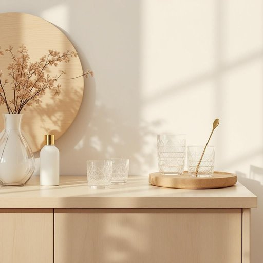

# barware

<h1 style="font-size: 2.5em; font-weight: 300; letter-spacing: 2px; margin: 0; color: #2c3e50;">
/barware*/
</h1>

---

---

## 例句

Whenever we host evening gatherings, I always make sure that our collection of barware—which includes elegant cocktail shakers, engraved glass tumblers, and a variety of intricate mixing spoons—is impeccably arranged on the sideboard, not only to impress our guests but also to make the process of preparing drinks both efficient and enjoyable.

*Whenever(/wɛˈnɛvər/) we(/wi/) host(/hoʊst/) evening(/ˈivnɪŋ/) gatherings,(/ˈgæðərɪŋz,/) I(/aɪ/) always(/ˈɔlˌweɪz/) make(/meɪk/) sure(/ʃʊr/) that(/ðət/) our(/ɑr/) collection(/kəˈlɛkʃən/) of(/əv/) barware—which(/barware—which*/) includes(/ˌɪnˈkludz/) elegant(/ˈɛləgənt/) cocktail(/ˈkɑkˌteɪl/) shakers,(/ˈʃeɪkərz,/) engraved(/ɪnˈgreɪvd/) glass(/glæs/) tumblers,(/ˈtəmblərz,/) and(/ənd/) a(/ə/) variety(/vərˈaɪəti/) of(/əv/) intricate(/ˈɪntrəkət/) mixing(/ˈmɪksɪŋ/) spoons—is(/spoons—is*/) impeccably(/ˌɪmˈpɛkəbli/) arranged(/əreɪnʤd/) on(/ɔn/) the(/ðə/) sideboard,(/sideboard*,/) not(/nɑt/) only(/ˈoʊnli/) to(/tɪ/) impress(/ˌɪmˈprɛs/) our(/ɑr/) guests(/gɛsts/) but(/bət/) also(/ˈɔlsoʊ/) to(/tɪ/) make(/meɪk/) the(/ðə/) process(/ˈprɔˌsɛs/) of(/əv/) preparing(/pərˈpɛrɪŋ/) drinks(/drɪŋks/) both(/boʊθ/) efficient(/ɪˈfɪʃənt/) and(/ənd/) enjoyable.(/ˌɛnˈʤɔɪəbəl./)*

**翻译：** 每当我们举办晚间聚会时，我总会确保我们的酒具收藏——包括精致的调酒壶、雕刻花纹的玻璃杯以及各种复杂的搅拌勺——整齐地陈列在餐边柜上，这不仅为了给客人留下深刻印象，也为了使调制饮品的过程既高效又愉悦。

---

## 解释

“barware”作为名词，在家居生活用品的语境中指的是用于家庭酒吧或饮酒场合的一系列餐具和工具，如酒杯、调酒器、开瓶器、冰桶、搅拌棒等。这些物品通常用于调制和享用各种酒类饮品，特别是鸡尾酒等混合饮品，适用于家庭聚会、娱乐或私人酒吧环境。英语学习者使用“barware”时需要注意，它是不可数名词，通常不用于复数形式，且多用于总体指代一类物品而非具体单个物件，常见的搭配有“barware set”（酒吧用具套装）、“classic barware”（经典酒吧器皿）等，表达时可结合具体描述或分类，如“glass barware”（玻璃酒具）。此外，“barware”作为集合名词，语法上通常搭配单数动词。该词源于“bar”（酒吧）与“ware”（器皿、器具）的合成构词，反映出其核心含义即“适用于酒吧的器具”，这一构词方式在现代英语中较为常见，表明商品类别。中文语境中，“barware”准确翻译为“酒吧用具”或“酒具”，强调其在饮酒和调酒场合的功能性，无明显褒贬色彩，但在文化层面上往往与休闲、社交、生活品质提升相关联，具有积极的生活方式含义。

---

<small style="color: #999; font-size: 0.9em;">2025-07-27 09:14:04</small>

