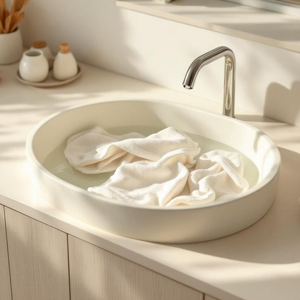

# basin

<h1 style="font-size: 2.5em; font-weight: 300; letter-spacing: 2px; margin: 0; color: #2c3e50;">
/ˈbeɪsən/
</h1>

---

---

## 例句

Could you please fill the basin in the kitchen sink with warm water and a bit of detergent, so that I can soak these stubborn stains out of the tea towels before we hang them up to dry by the window?

*Could(/kʊd/) you(/ju/) please(/pliz/) fill(/fɪl/) the(/ðə/) basin(/ˈbeɪsən/) in(/ɪn/) the(/ðə/) kitchen(/ˈkɪʧən/) sink(/sɪŋk/) with(/wɪθ/) warm(/wɔrm/) water(/ˈwɔtər/) and(/ənd/) a(/ə/) bit(/bɪt/) of(/əv/) detergent,(/dɪˈtərʤənt,/) so(/soʊ/) that(/ðət/) I(/aɪ/) can(/kən/) soak(/soʊk/) these(/ðiz/) stubborn(/ˈstəbərn/) stains(/steɪnz/) out(/aʊt/) of(/əv/) the(/ðə/) tea(/ti/) towels(/taʊəlz/) before(/ˌbiˈfɔr/) we(/wi/) hang(/hæŋ/) them(/ðɛm/) up(/əp/) to(/tɪ/) dry(/draɪ/) by(/baɪ/) the(/ðə/) window?(/ˈwɪndoʊ?/)*

**翻译：** 你能否请将厨房水槽中的盆子注满温水，加一点洗涤剂，这样我就能先将这些茶巾上的顽固污渍浸泡干净，然后再挂到窗边晾干？

---

## 解释

英语单词"basin"作为名词，在家居生活用品的语境中主要指澡盆、水盆或洗脸盆，通常用于盛水以供洗手、洗脸或其他日常清洁活动，常见于浴室或厨房等场合。学习者在使用时应注意，basin多用作可数名词，复数形式为basins，且常与动词如“fill”（装满）、“wash”（洗）、“drain”（排水）搭配，如“fill the basin with water”表示“把盆装满水”。此外，basin还可与形容词连用，如“large basin”（大盆）、“shallow basin”（浅盆）。从语法上讲，basin不能直接取代sink（水槽）或tub（浴缸），因其更偏向于便携式或固定的洗脸盆器具，区分这些词有助避免用词错误。词源方面，basin起源于中古英语，源自古法语"bacin"，其根源可追溯至拉丁语"bacinum"，意指一种盛水的容器，体现了该词固有的盛水功能。中文语境中，“basin”一般准确翻译为“盆”或“脸盆”，强调日常生活中用于盛水洗涤的器具，无褒贬色彩，属于中性词汇，不带有特殊的文化内涵或情感评价。综上，basin作为家居用品名词时，指的是一种常见的洗涤用盆，使用时需注意其语法搭配及与其他类似词的细微区别，以确保表达精准。

---

<small style="color: #999; font-size: 0.9em;">2025-07-27 09:14:04</small>

