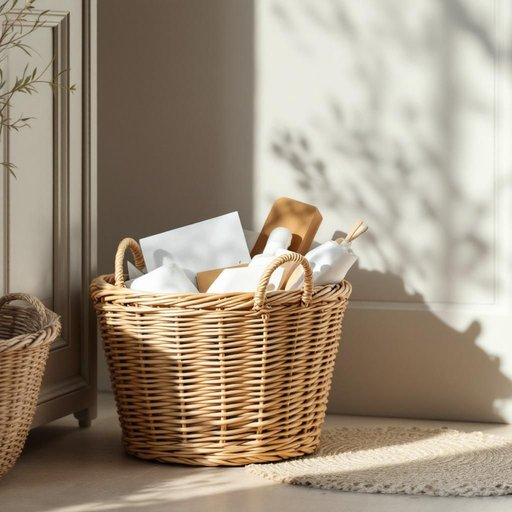

# basket

<h1 style="font-size: 2.5em; font-weight: 300; letter-spacing: 2px; margin: 0; color: #2c3e50;">
/ˈbæskət/
</h1>

---

---

## 例句

Could you please empty the basket by the door, which has been overflowing with last week’s mail and all the little bits of rubbish that seem to accumulate despite our best efforts to keep the hallway tidy?

*Could(/kʊd/) you(/ju/) please(/pliz/) empty(/ˈɛmti/) the(/ðə/) basket(/ˈbæskət/) by(/baɪ/) the(/ðə/) door,(/dɔr,/) which(/wɪʧ/) has(/həz/) been(/bɪn/) overflowing(/ˈoʊvərˌfloʊɪŋ/) with(/wɪθ/) last(/læst/) week’s(/week’s*/) mail(/meɪl/) and(/ənd/) all(/ɔl/) the(/ðə/) little(/ˈlɪtəl/) bits(/bɪts/) of(/əv/) rubbish(/ˈrəbɪʃ/) that(/ðət/) seem(/sim/) to(/tɪ/) accumulate(/əˈkjumjəˌleɪt/) despite(/dɪˈspaɪt/) our(/ɑr/) best(/bɛst/) efforts(/ˈɛfərts/) to(/tɪ/) keep(/kip/) the(/ðə/) hallway(/ˈhɔlˌweɪ/) tidy?(/ˈtaɪdi?/)*

**翻译：** 能否请您清空门口的篮子？里面堆满了上周的邮件和各种小垃圾，虽然我们尽力保持走廊整洁，但这些杂物仍不知不觉地积累起来。

---

## 解释

英语单词“basket”作为名词在家居生活用品场景中主要指用来盛放或携带物品的容器，通常由编织的柳条、藤条、塑料或其他材料制成，形状多为开口容器，便于收纳和运输各种日常用品，如水果、衣物、杂物等。在具体使用场合，比如家庭厨房装水果篮、浴室用的洗衣篮、储物用的杂货篮等，都是非常常见的应用场景。英语学习者需要注意“basket”通常是可数名词，前面可以加不定冠词a，例如a basket，也可以用复数形式baskets；此外，“basket”常与介词短语连用，如 “a basket of apples”表示“一篮苹果”。在表达技巧上，“basket”可以用作固定搭配如“laundry basket”（洗衣篮）、“picnic basket”（野餐篮）等，理解上下文很关键。词源方面，“basket”源自中古英语的“basket”，其根源可追溯至古法语“baschet”，最终源自古意大利语或拉丁语，均与“编织”相关，说明其历史上就是以编织材料制成的容器。在中文语境中，“basket”一般被准确译为“篮子”、“筐”或“提篮”，根据具体用途可细分为“水果篮”、“洗衣篮”等，体现其功能性和材质特征。该词本身在文化或情感层面无明显褒贬色彩，属于中性词汇，但在某些表达中，例如“throw something into the basket”（将某物随手放入篮中）可带有随意收纳的含义。此外，运动赛场上“basket”特指篮球中的“得分”，但这与家居语境无关。综上，“basket”作为家居生活用品名词使用时，重点在于其容器属性、材料特征及与具体物品搭配的灵活运用。

---

<small style="color: #999; font-size: 0.9em;">2025-07-27 09:14:04</small>

