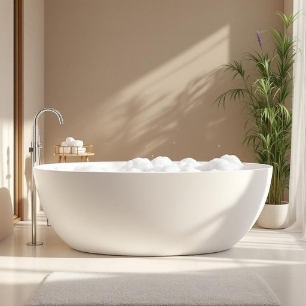

# bath

<h1 style="font-size: 2.5em; font-weight: 300; letter-spacing: 2px; margin: 0; color: #2c3e50;">
/bæθ/
</h1>

---

---

## 例句

After a long day of work, I usually fill the bath with lavender-scented bubbles and warm water, allowing myself to unwind completely while listening to some classical music or reading a good book.

*After(/ˈæftər/) a(/ə/) long(/lɔŋ/) day(/deɪ/) of(/əv/) work,(/wərk,/) I(/aɪ/) usually(/ˈjuʒəwəli/) fill(/fɪl/) the(/ðə/) bath(/bæθ/) with(/wɪθ/) lavender-scented(/lavender-scented*/) bubbles(/ˈbəbəlz/) and(/ənd/) warm(/wɔrm/) water,(/ˈwɔtər,/) allowing(/əˈlaʊɪŋ/) myself(/ˌmaɪˈsɛlf/) to(/tɪ/) unwind(/ənˈwaɪnd/) completely(/kəmˈplitli/) while(/waɪl/) listening(/ˈlɪsənɪŋ/) to(/tɪ/) some(/səm/) classical(/ˈklæsɪkəl/) music(/mˈjuzɪk/) or(/ər/) reading(/ˈrɛdɪŋ/) a(/ə/) good(/gʊd/) book.(/bʊk./)*

**翻译：** 忙碌一天后，我通常会注满薰衣草香氛的泡泡浴和温暖的水，让自己在聆听古典音乐或阅读一本好书时，彻底放松身心。

---

## 解释

英语单词“bath”作为名词，在家居生活用品的语境中主要指浴缸或洗澡用的容器，具体使用场合多涉及浴室、洗澡、个人卫生及美容护理等场景，如“take a bath”（洗澡）、“fill the bath with water”（把浴缸装满水）等。在语法上，“bath”是可数名词，可用于单数形式指某一次的洗澡或某个具体的浴缸，也可以用复数“baths”表示多次洗澡或多个浴缸，常见搭配有“have a bath”（洗个澡）、“bath towel”（浴巾）、“bath water”（浴水）等，学习者还应注意“bath”与“bathe”（动词，洗澡）和“bathroom”（浴室）的区别及用法。词源方面，“bath”源自古英语“bæth”，其根源可追溯到更早的日耳曼语系，原意即为“浸泡”或“洗澡”，体现了其起始阶段与水相关的含义。在中文语境中，“bath”准确翻译为“浴缸”或“洗澡（行为）”，根据具体语境选择，前者侧重指物件，后者则表达动作或过程，无褒贬色彩，属于中性词汇，文化上西方国家的洗澡习惯和设施可能与中国存在差异，但“bath”在现代家居生活中普遍指代浴缸这一固定家居用品。

---

<small style="color: #999; font-size: 0.9em;">2025-07-27 09:14:04</small>

