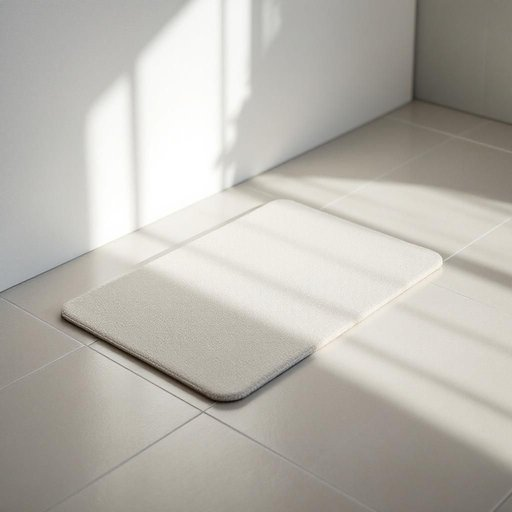

# bathmat

<h1 style="font-size: 2.5em; font-weight: 300; letter-spacing: 2px; margin: 0; color: #2c3e50;">
/bathmat*/
</h1>

---

---

## 例句

After slipping on the wet tiles this morning, I’ve decided it’s high time we replace the old, threadbare bathmat—preferably with one that’s both highly absorbent and quick-drying, so we can avoid any future accidents in the bathroom while maintaining a touch of style.

*After(/ˈæftər/) slipping(/sˈlɪpɪŋ/) on(/ɔn/) the(/ðə/) wet(/wɛt/) tiles(/taɪlz/) this(/ðɪs/) morning,(/ˈmɔrnɪŋ,/) I’ve(/i’ve*/) decided(/ˌdɪˈsaɪdɪd/) it’s(/it’s*/) high(/haɪ/) time(/taɪm/) we(/wi/) replace(/ˌriˈpleɪs/) the(/ðə/) old,(/oʊld,/) threadbare(/θˈrɛdˌbɛr/) bathmat—preferably(/bathmat—preferably*/) with(/wɪθ/) one(/wən/) that’s(/that’s*/) both(/boʊθ/) highly(/ˈhaɪli/) absorbent(/əbˈzɔrbənt/) and(/ənd/) quick-drying,(/quick-drying*,/) so(/soʊ/) we(/wi/) can(/kən/) avoid(/əˈvɔɪd/) any(/ˈɛni/) future(/fˈjuʧər/) accidents(/ˈæksədənts/) in(/ɪn/) the(/ðə/) bathroom(/ˈbæθˌrum/) while(/waɪl/) maintaining(/meɪnˈteɪnɪŋ/) a(/ə/) touch(/təʧ/) of(/əv/) style.(/staɪl./)*

**翻译：** 今晨我在湿滑的瓷砖上滑倒后，决定是时候更换那块陈旧破损的浴室垫了，最好选一块既吸水性强又速干的，这样既能避免日后浴室发生意外，也能保持一份雅致。

---

## 解释

bathmat作为名词在家居生活用品场景中指的是浴室中放置在淋浴间或浴缸外，用以吸水、防滑和保持地面干燥的小型垫子，常见材质包括橡胶、泡沫或纤维织物，具体使用场合多为浴室，用于防止人们洗澡后脚底带水滑倒，保持地面整洁干燥，英语学习者使用bathmat时需注意其为可数名词，通常搭配限定词如a bathmat，the bathmat或形容词如soft, thick, non-slip等，表达方式中常出现固定搭配如“step onto the bathmat”（踩到浴室垫）， “wet bathmat”或“wash the bathmat”（清洗浴室垫）等，词源方面，bathmat由bath（浴，下水处）和mat（垫子）构成，直接体现其功能属性和使用环境，起源清晰直观，在中文语境中，bathmat应准确翻译为“浴室垫”或“浴室脚垫”，明确指代用于浴室防滑和吸水的垫子，避免与地毯、地垫等其他垫类混淆，该词在语义上中性无褒贬或特殊文化内涵，但因浴室安全考虑，其功能性和实用性在家居用品中较为突出，常见于日常生活对浴室安全和卫生的讨论中。

---

<small style="color: #999; font-size: 0.9em;">2025-07-27 09:14:04</small>

