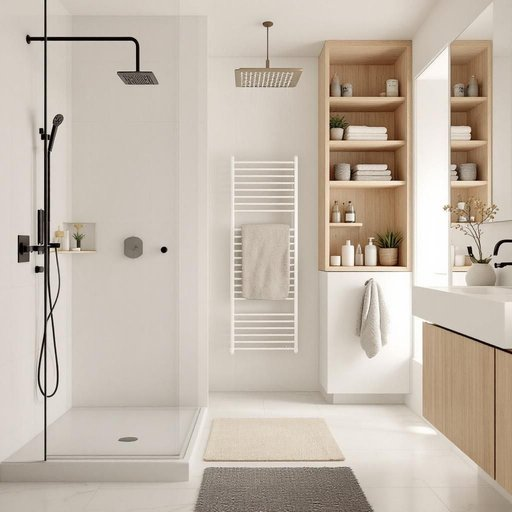

# bathroom

<h1 style="font-size: 2.5em; font-weight: 300; letter-spacing: 2px; margin: 0; color: #2c3e50;">
/ˈbæθˌrum/
</h1>

---

---

## 例句

Could you please check if the bathroom, which we recently renovated with the heated floors and the new rainfall showerhead, has enough storage space for all the towels and toiletries before our guests arrive tomorrow?

*Could(/kʊd/) you(/ju/) please(/pliz/) check(/ʧɛk/) if(/ɪf/) the(/ðə/) bathroom,(/ˈbæθˌrum,/) which(/wɪʧ/) we(/wi/) recently(/ˈrisəntli/) renovated(/ˈrɛnəˌveɪtɪd/) with(/wɪθ/) the(/ðə/) heated(/ˈhitɪd/) floors(/flɔrz/) and(/ənd/) the(/ðə/) new(/nu/) rainfall(/ˈreɪnˌfɔl/) showerhead,(/showerhead*,/) has(/həz/) enough(/ɪˈnəf/) storage(/ˈstɔrɪʤ/) space(/speɪs/) for(/fər/) all(/ɔl/) the(/ðə/) towels(/taʊəlz/) and(/ənd/) toiletries(/ˈtɔɪlətriz/) before(/ˌbiˈfɔr/) our(/ɑr/) guests(/gɛsts/) arrive(/əraɪv/) tomorrow?(/təˈmɑˌroʊ?/)*

**翻译：** 请您确认一下，我们最近装修的浴室，配备了地暖和新的雨淋花洒，是否有足够的储物空间来放置所有毛巾和洗漱用品，以便明天客人来访时使用？

---

## 解释

英语单词“bathroom”作为名词，主要指住宅或公共场所中供洗浴、如厕和个人清洁使用的房间，通常包括浴缸、淋浴间、洗手盆和马桶等设施。在家居生活用品的语境中，人们常在描述房屋布局、家居清洁或日常生活场景时提及，例如“Please clean the bathroom”（请打扫浴室）或“How many bathrooms does your house have?”（你家有几个浴室？）。英语学习者需要注意，“bathroom”既可指带有浴缸或淋浴设施的专用洗浴间，也常用作委婉表达“厕所”，尤其在美国英语中广泛用来指代含马桶的房间，因此语境判断尤为重要。语法上，“bathroom”作可数名词，复数形式为“bathrooms”，常见搭配有“master bathroom”（主浴室）、“guest bathroom”（客用浴室）、“half bathroom”（仅有洗手盆和马桶，无浴缸的半卫浴）等表达。其词源来源于“bath”（洗澡）与“room”（房间）的组合，起初专指用于洗澡的房间，后来引申为包含洗浴和如厕设施的卫生间。在中文语境中，“bathroom”通常翻译为“浴室”或“卫生间”，视具体设施和使用习惯而定，需区分“浴室”（强调洗浴功能）和“卫生间”（侧重洗手间和厕所功能）以避免误解。需要特别指出的是，英国英语中，“bathroom”多指带浴缸的洗浴空间，而“toilet”则专指马桶所在的房间，而美国英语中“bathroom”往往涵盖厕所功能，因此使用时要注意地区差异。“Bathroom”本身无特殊褒贬含义，但在不同文化中对空间隐私和清洁的重视程度有所区别，影响其具体使用语境和表达方式。

---

<small style="color: #999; font-size: 0.9em;">2025-07-27 09:14:04</small>

