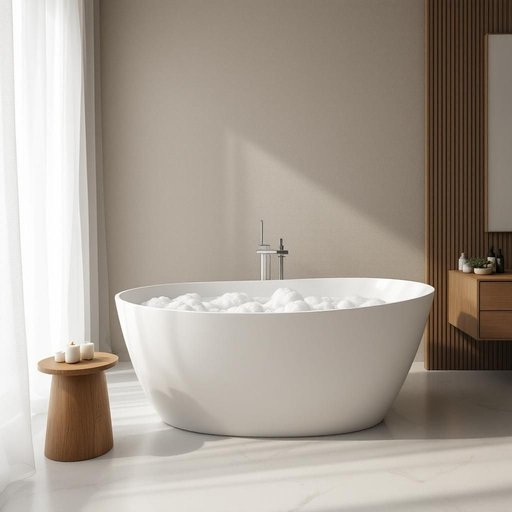

# bathtub

<h1 style="font-size: 2.5em; font-weight: 300; letter-spacing: 2px; margin: 0; color: #2c3e50;">
/ˈbæθtəb/
</h1>

---

---

## 例句

After completing the exhaustive gardening and supervising the children's chaotic playroom, I cherished the moment of solitude by running a hot bath filled with scented bubbles and essential oils, sinking in deeply while the warmth and soothing aromas alleviated the day's stresses.

*After(/ˈæftər/) completing(/kəmˈplitɪŋ/) the(/ðə/) exhaustive(/ɪgˈzɔstɪv/) gardening(/ˈgɑrdənɪŋ/) and(/ənd/) supervising(/ˈsupərˌvaɪzɪŋ/) the(/ðə/) children's(/ˈʧɪldrənz/) chaotic(/keɪˈɑtɪk/) playroom,(/ˈpleɪˌrum,/) I(/aɪ/) cherished(/ˈʧɛrɪʃt/) the(/ðə/) moment(/ˈmoʊmənt/) of(/əv/) solitude(/ˈsɑləˌtud/) by(/baɪ/) running(/ˈrənɪŋ/) a(/ə/) hot(/hɑt/) bath(/bæθ/) filled(/fɪld/) with(/wɪθ/) scented(/ˈsɛntɪd/) bubbles(/ˈbəbəlz/) and(/ənd/) essential(/ɛˈsɛnʃəl/) oils,(/ɔɪlz,/) sinking(/ˈsɪŋkɪŋ/) in(/ɪn/) deeply(/ˈdipli/) while(/waɪl/) the(/ðə/) warmth(/wɔrmθ/) and(/ənd/) soothing(/ˈsuðɪŋ/) aromas(/ərˈoʊməz/) alleviated(/əˈliviˌeɪtɪd/) the(/ðə/) day's(/deɪz/) stresses.(/ˈstrɛsɪz./)*

**翻译：** 在完成了繁重的园艺工作并监管了孩子们那混乱的游戏室后，我珍惜这片刻的宁静，放满香氛泡泡和精油的热水澡中深深沉浸，让温暖与怡人的香气缓解了一天的疲惫与压力。

---

## 解释

请按照以下格式要求格式化结果，只返回格式化后的内容，不要包含任何解释、思考过程或额外标记。请执行以下清理操作：1. 移除所有<think>标签及其内容；2. 移除所有[Ignore this...]标记；3. 如果存在JSON格式要求，确保输出符合要求；4. 移除\boxed{...}的标记，保留内容；5. 清理多余空白和换行；6. 按照格式要求排版和格式化；7. 不要添加任何解释或元信息；8. 对于输入的重要信息，输出为一整个段落，不要输出markdown内容，也不要输出bullet points，也不要增加信息，也不要删除信息。格式要求：格式要求简短描述：回答必须是一个连贯的中文段落，不能分段，不能使用Markdown符号，不添加标题或其他信息，仅包含解释内容。格式示例：“bathtub”作为名词，在家居生活用品的语境中指的是浴缸，是一种专门用于装水供人洗浴的容器，通常固定在浴室内。具体使用场合多见于家庭、酒店、疗养院等洗浴场所，语境中常涉及洗澡、浴室设施、家居装修等话题。英语学习者在使用“bathtub”时需注意它是一个可数名词，通常前面可加冠词the或a，如“a bathtub”，且复数形式为“bathtubs”。常见搭配包括“take a bath in the bathtub”（在浴缸里洗澡）、“fill the bathtub with water”（给浴缸放水）等表达。词源方面，“bathtub”由“bathe”（洗澡）和“tub”（桶、盆）组合而成，反映了其功能属性，该词最早见于19世纪中叶，随着家庭卫浴设施的发展而普及。在中文语境中，“bathtub”准确翻译为“浴缸”，意指供洗浴用的大型容器，通常为长方形或椭圆形，材质多样如瓷、亚克力、金属等。该词无特殊语言色彩，属于中性词汇，没有褒义或贬义，同时在文化上反映了一种现代化生活方式和家居舒适度的提升。

---

<small style="color: #999; font-size: 0.9em;">2025-07-27 09:14:04</small>

