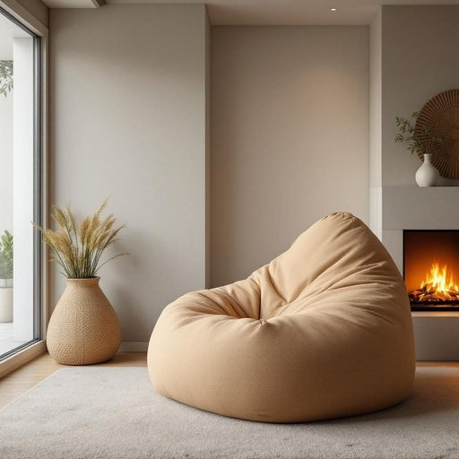

# beanbag

<h1 style="font-size: 2.5em; font-weight: 300; letter-spacing: 2px; margin: 0; color: #2c3e50;">
/beanbag*/
</h1>

---

---

## 例句

After rearranging the living room to make space for the children’s play area, I decided to place the oversized beanbag, which is not only filled with thousands of tiny beads that conform to your body shape but also covered in a soft, durable fabric, right next to the fireplace so that anyone can relax comfortably while reading or watching TV.

*After(/ˈæftər/) rearranging(/ˌriərˈeɪnʤɪŋ/) the(/ðə/) living(/ˈlɪvɪŋ/) room(/rum/) to(/tɪ/) make(/meɪk/) space(/speɪs/) for(/fər/) the(/ðə/) children’s(/children’s*/) play(/pleɪ/) area,(/ˈɛriə,/) I(/aɪ/) decided(/ˌdɪˈsaɪdɪd/) to(/tɪ/) place(/pleɪs/) the(/ðə/) oversized(/ˈoʊvərˌsaɪzd/) beanbag,(/beanbag*,/) which(/wɪʧ/) is(/ɪz/) not(/nɑt/) only(/ˈoʊnli/) filled(/fɪld/) with(/wɪθ/) thousands(/ˈθaʊzənz/) of(/əv/) tiny(/ˈtaɪni/) beads(/bidz/) that(/ðət/) conform(/kənˈfɔrm/) to(/tɪ/) your(/jʊr/) body(/ˈbɑdi/) shape(/ʃeɪp/) but(/bət/) also(/ˈɔlsoʊ/) covered(/ˈkəvərd/) in(/ɪn/) a(/ə/) soft,(/sɔft,/) durable(/ˈdʊrəbəl/) fabric,(/ˈfæbrɪk,/) right(/raɪt/) next(/nɛkst/) to(/tɪ/) the(/ðə/) fireplace(/ˈfaɪərˌpleɪs/) so(/soʊ/) that(/ðət/) anyone(/ˈɛniˌwən/) can(/kən/) relax(/rɪˈlæks/) comfortably(/ˈkəmfərtəbli/) while(/waɪl/) reading(/ˈrɛdɪŋ/) or(/ər/) watching(/ˈwɑʧɪŋ/) TV.(/ˌtɛləˈvɪʒən./)*

**翻译：** 在重新布置客厅以腾出儿童游戏区的空间后，我决定将那个超大号豆袋放在壁炉旁边。这个豆袋不仅填充着数千颗能贴合身体曲线的小珠子，而且覆盖着柔软且耐用的布料，任何人在那里读书或看电视时都能舒适地放松。

---

## 解释

英语单词“beanbag”作为名词，主要指一种充满小颗粒（通常是塑料、泡沫珠或小豆子）的软垫，多用于家居生活中作为休闲座椅或靠垫。这种beanbag通常形状不规则，能够根据使用者体态变形，提供舒适的坐卧体验，常见于客厅、儿童房或休闲区，适合放松和非正式的场合。对于英语学习者而言，beanbag作为可数名词，使用时应注意单复数形式“beanbag/beanbags”，且常与动词“sit on”、“use”等搭配，如“sit on a beanbag”或“a beanbag chair”；此外，beanbag常与形容词搭配，如“comfortable beanbag”，表达其舒适性；在表达时也可作为复合名词的一部分，如“beanbag toss”（一种投掷游戏）。词源方面，“beanbag”由“bean”（豆子）和“bag”（袋子）组成，最初指装满豆子的袋子，由于豆子赋予袋子柔软形态，后来引申为类似填充物的小颗粒，用以填充软垫类家具。中文语境中，“beanbag”通常被准确译为“豆袋椅”或“懒人沙发”，强调其柔软、可塑形和休闲舒适的特性；在使用时应避免直接音译或意译成泛泛的“软垫”，以免丧失其特有的家具属性。该词本身无明显褒贬色彩，但随着现代家居文化发展，beanbag作为一种轻松、非正式的现代家具象征，也带有一定的休闲生活方式的文化内涵。

---

<small style="color: #999; font-size: 0.9em;">2025-07-27 09:14:04</small>

