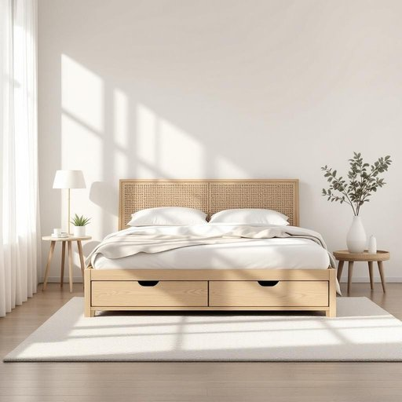

# bed

<h1 style="font-size: 2.5em; font-weight: 300; letter-spacing: 2px; margin: 0; color: #2c3e50;">
/bɛd/
</h1>

---

---

## 例句

After finally assembling the new bed, which came with an intricate headboard and built-in storage drawers beneath, we realised that it not only transformed the bedroom’s aesthetic but also maximised the limited space, making it perfect for both sleeping and keeping extra bedding neatly tucked away.

*After(/ˈæftər/) finally(/ˈfaɪnəli/) assembling(/əˈsɛmbəlɪŋ/) the(/ðə/) new(/nu/) bed,(/bɛd,/) which(/wɪʧ/) came(/keɪm/) with(/wɪθ/) an(/ən/) intricate(/ˈɪntrəkət/) headboard(/ˈhɛdˌbɔrd/) and(/ənd/) built-in(/ˈbɪlˌtɪn/) storage(/ˈstɔrɪʤ/) drawers(/drɔrz/) beneath,(/bɪˈniθ,/) we(/wi/) realised(/ˈriəˌlaɪzd/) that(/ðət/) it(/ɪt/) not(/nɑt/) only(/ˈoʊnli/) transformed(/trænsˈfɔrmd/) the(/ðə/) bedroom’s(/bedroom’s*/) aesthetic(/ɛsˈθɛtɪk/) but(/bət/) also(/ˈɔlsoʊ/) maximised(/maximised*/) the(/ðə/) limited(/ˈlɪmɪtɪd/) space,(/speɪs,/) making(/ˈmeɪkɪŋ/) it(/ɪt/) perfect(/ˈpərˌfɪkt/) for(/fər/) both(/boʊθ/) sleeping(/sˈlipɪŋ/) and(/ənd/) keeping(/ˈkipɪŋ/) extra(/ˈɛkstrə/) bedding(/ˈbɛdɪŋ/) neatly(/ˈnitli/) tucked(/təkt/) away.(/əˈweɪ./)*

**翻译：** 最终组装好这张带有精致床头板和内置储物抽屉的新床后，我们发现它不仅改变了卧室的整体格调，还最大限度地利用了有限的空间，使其既适合睡眠，又能整齐收纳额外的床上用品。

---

## 解释

英语单词“bed”作为名词，在家居生活用品场景中指的是供人睡觉或休息用的家具，即“床”。具体使用场合通常出现在描述卧室布置、购买家具、住宿环境或谈论睡眠安排时，如“I bought a new bed for my room”（我为我的房间买了一张新床）。英语学习者在使用“bed”时需注意其可数性，单数形式为“bed”，复数为“beds”，且常见搭配有“make the bed”（整理床铺）、“go to bed”（上床睡觉）、“bed sheet”（床单）、“bed frame”（床架）、“bedroom”（卧室，虽含有bed但为复合词）等。此外，“bed”常与介词搭配形成固定表达，如“in bed”（在床上）和“get out of bed”（起床）。词源方面，“bed”源自古英语“bedd”，表示休息的地方，起初不仅指家具，也包括地上的睡垫，反映了人类从地面睡觉到使用家具睡觉的演变过程。在中文语境中，“bed”准确翻译为“床”，强调其作为睡觉用具的功能，区别于“床铺”、“铺位”等较宽泛或临时性的说法。该词无特别的褒贬色彩，是一个中性词，但在某些文学或文化表达中，“bed”可引申为安稳、私密的象征，或在俚语中带有性暗示，因此学习者需根据语境谨慎判断。此外，“bed”在家居用品语境之外还有地理（如“river bed”指河床）和农业（如“flower bed”指种植床）等多义扩展，但在家居生活用品领域特指睡觉用的家具。

---

<small style="color: #999; font-size: 0.9em;">2025-07-27 09:14:04</small>

