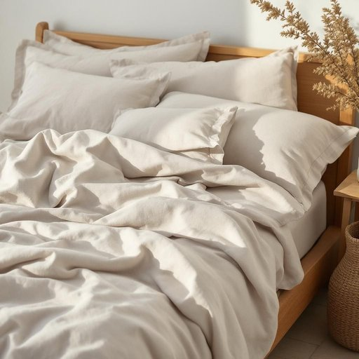

# bedding

<h1 style="font-size: 2.5em; font-weight: 300; letter-spacing: 2px; margin: 0; color: #2c3e50;">
/ˈbɛdɪŋ/
</h1>

---

---

## 例句

Before the meeting concluded, the manager emphasized that the success of the company relies heavily on the innovation and dedication of its workforce, making talent the most valuable asset in achieving long-term goals.

*Before(/ˌbiˈfɔr/) the(/ðə/) meeting(/ˈmitɪŋ/) concluded,(/kənˈkludɪd,/) the(/ðə/) manager(/ˈmænɪʤər/) emphasized(/ˈɛmfəˌsaɪzd/) that(/ðət/) the(/ðə/) success(/səkˈsɛs/) of(/əv/) the(/ðə/) company(/ˈkəmpəˌni/) relies(/rɪˈlaɪz/) heavily(/ˈhɛvəli/) on(/ɔn/) the(/ðə/) innovation(/ˌɪnəˈveɪʃən/) and(/ənd/) dedication(/ˌdɛdəˈkeɪʃən/) of(/əv/) its(/ɪts/) workforce,(/ˈwərkˌfɔrs,/) making(/ˈmeɪkɪŋ/) talent(/ˈtælənt/) the(/ðə/) most(/moʊst/) valuable(/ˈvæljəbəl/) asset(/ˈæˌsɛt/) in(/ɪn/) achieving(/əˈʧivɪŋ/) long-term(/ˈlɔŋˈtərm/) goals.(/goʊlz./)*

**翻译：** 会议结束前，经理强调，公司能否成功很大程度上依赖于员工的创新与奉献精神，因此人才是实现长期目标最宝贵的财富。

---

## 解释

英语单词“bedding”作为名词在家居生活用品场景中，主要指床上用品，包括床单、被罩、枕套、毯子、被子等用来覆盖和装饰床铺的纺织品，通常用于卧室环境，如家庭、旅馆或医院中。使用时，bedding通常指一整套或若干组成部分的集合，常见搭配有“bedroom bedding”（卧室床上用品）、“bedding set”（床品套装）、“change the bedding”（换床单被罩）等。学习者需注意，bedding是一个不可数名词，通常不加复数形式；当指具体物品时，常用“bedding items”或“pieces of bedding”等说法来表达复数。语法上，“bedding”多用作集合名词，搭配动词时应使用单数形式，如“The bedding is clean.”词源上，“bedding”来自动词“bed”的动名词形式，原意为“为床铺设被褥”，最终演变为指一套为床铺准备的织物用品，这一词根反映了其功能性与用途的起源。在中文语境中，准确翻译为“床上用品”，涵盖被褥、床单、枕头套等；不同于单纯的被子或床单，强调其整体功能和组合特性。该词在使用中无褒贬色彩，属中性词汇，文化上反映了人们对舒适睡眠环境的关注及床品在日常生活中的普遍存在。

---

<small style="color: #999; font-size: 0.9em;">2025-07-27 09:14:04</small>

