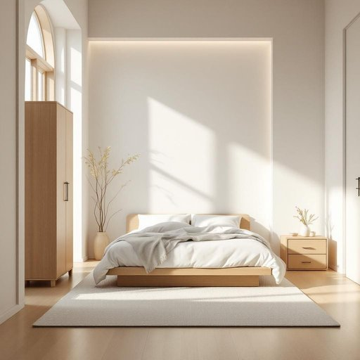

# bedroom

<h1 style="font-size: 2.5em; font-weight: 300; letter-spacing: 2px; margin: 0; color: #2c3e50;">
/ˈbɛˌdrum/
</h1>

---

---

## 例句

After we finish redecorating the living room and the kitchen, could you help me rearrange the furniture in the bedroom, especially since the new bed frame I ordered is much larger and might not fit through the doorway as easily as I initially thought?

*After(/ˈæftər/) we(/wi/) finish(/ˈfɪnɪʃ/) redecorating(/riˈdɛkərˌeɪtɪŋ/) the(/ðə/) living(/ˈlɪvɪŋ/) room(/rum/) and(/ənd/) the(/ðə/) kitchen,(/ˈkɪʧən,/) could(/kʊd/) you(/ju/) help(/hɛlp/) me(/mi/) rearrange(/riəreɪnʤ/) the(/ðə/) furniture(/ˈfərnɪʧər/) in(/ɪn/) the(/ðə/) bedroom,(/ˈbɛˌdrum,/) especially(/əˈspɛʃəli/) since(/sɪns/) the(/ðə/) new(/nu/) bed(/bɛd/) frame(/freɪm/) I(/aɪ/) ordered(/ˈɔrdərd/) is(/ɪz/) much(/məʧ/) larger(/ˈlɑrʤər/) and(/ənd/) might(/maɪt/) not(/nɑt/) fit(/fɪt/) through(/θru/) the(/ðə/) doorway(/ˈdɔrˌweɪ/) as(/ɛz/) easily(/ˈizəli/) as(/ɛz/) I(/aɪ/) initially(/ˌɪˈnɪʃəli/) thought?(/θɔt?/)*

**翻译：** 等我们完成了客厅和厨房的重新装修后，能否请你帮我重新布置一下卧室的家具？尤其是我订购的新床架体积较大，可能不像我最初想的那样轻松通过门口。

---

## 解释

英语单词“bedroom”作为名词，指的是住宅中专门用来睡觉和休息的房间，通常配备床和相关家具，如衣柜、床头柜等，常见于家庭、酒店、公寓等居住场所。在家居生活用品的语境中，“bedroom”具体使用场合包括谈论房屋布局、租房买房描述、家居装修设计以及日常生活中的房间安排等。英语学习者在使用“bedroom”时应注意，该词为复合名词，由“bed”（床）与“room”（房间）组成，通常作单数或复数（bedrooms）使用，且作为可数名词存在时不可直接加冠词“the”除非特指某一房间，例如“We have three bedrooms”或“This is my bedroom”。“bedroom”常见搭配有bedroom furniture（卧室家具）、bedroom door（卧室门）、master bedroom（主卧）、bedroom window（卧室窗户）等，表达时应结合具体情境明确指代。词源方面，“bedroom”源自中古英语“bed”与“room”的直接组合，意指摆放床的房间，结构直白，反映了其功能性质，无复杂的文化隐喻或褒贬含义。在中文语境中，“bedroom”准确翻译为“卧室”，强调私密的休息空间，区别于其他房间如客厅、厨房等；其使用具中性、日常性质，不带特殊情感色彩或文化负担，理解时应注重其作为生活空间的基本功能角色。

---

<small style="color: #999; font-size: 0.9em;">2025-07-27 09:14:04</small>

