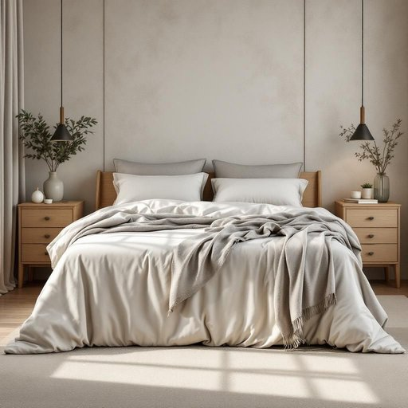

# bedspread

<h1 style="font-size: 2.5em; font-weight: 300; letter-spacing: 2px; margin: 0; color: #2c3e50;">
/ˈbɛdˌsprɛd/
</h1>

---

---

## 例句

After carefully choosing a bedspread that complemented both the vintage wallpaper and the oak bedside table, she spent the entire afternoon adjusting the cushions and folding the throw blanket neatly to create a cozy yet elegant atmosphere in the guest bedroom.

*After(/ˈæftər/) carefully(/ˈkɛrfəli/) choosing(/ˈʧuzɪŋ/) a(/ə/) bedspread(/ˈbɛdˌsprɛd/) that(/ðət/) complemented(/ˈkɑmpləˌmɛntɪd/) both(/boʊθ/) the(/ðə/) vintage(/ˈvɪntɪʤ/) wallpaper(/ˈwɔlˌpeɪpər/) and(/ənd/) the(/ðə/) oak(/oʊk/) bedside(/ˈbɛdˌsaɪd/) table,(/ˈteɪbəl,/) she(/ʃi/) spent(/spɛnt/) the(/ðə/) entire(/ɪnˈtaɪər/) afternoon(/ˌæftərˈnun/) adjusting(/əˈʤəstɪŋ/) the(/ðə/) cushions(/ˈkʊʃənz/) and(/ənd/) folding(/ˈfoʊldɪŋ/) the(/ðə/) throw(/θroʊ/) blanket(/ˈblæŋkɪt/) neatly(/ˈnitli/) to(/tɪ/) create(/kriˈeɪt/) a(/ə/) cozy(/ˈkoʊzi/) yet(/jɛt/) elegant(/ˈɛləgənt/) atmosphere(/ˈætməsˌfɪr/) in(/ɪn/) the(/ðə/) guest(/gɛst/) bedroom.(/ˈbɛˌdrum./)*

**翻译：** 她细心挑选了一条既搭配复古壁纸又适合橡木床头柜的床罩，整个下午都在调整垫子并整齐地叠放毛毯，力求营造出温馨雅致的客房氛围。

---

## 解释

“bedspread”作为名词，指的是一种覆盖在床铺上用于装饰和保护床单的床罩，常见于卧室的家居生活用品中，既能增加卧室的美观，也能保持床铺整洁和温暖。使用场合多为描述卧室布置、家居装饰或购买寝具时，如“You should choose a bedspread that matches your curtains”（你应该选择一款与窗帘相配的床罩）。英语学习者需注意“bedspread”一般用作可数名词，搭配时常见表达有“a bedspread set”、“a quilted bedspread”、“a decorative bedspread”等，此外动词短语搭配较少，更多用作名词短语的修饰核心。词源方面，“bedspread”由“bed”（床）与“spread”（展开、铺开）组合而成，最早起源可追溯至16世纪，意指铺开在床上的布料，强调其覆盖和展开的功能。中文语境中，“bedspread”可准确翻译为“床罩”或“床单罩”，区别于“被子”或“毯子”，其侧重点在于装饰性和覆盖性，常见于中高档卧室陈设描述，没有特殊的褒贬含义或文化色彩，但在美国家庭文化中，选择合适的bedspread往往反映个人的审美和生活品质，体现一定的生活情趣和居家氛围。

---

<small style="color: #999; font-size: 0.9em;">2025-07-27 09:14:04</small>

