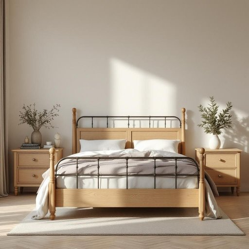

# bedstead

<h1 style="font-size: 2.5em; font-weight: 300; letter-spacing: 2px; margin: 0; color: #2c3e50;">
/bedstead*/
</h1>

---

---

## 例句

Although the old bedstead, with its intricately carved wooden posts and wrought iron frame, might seem too traditional for our modern bedroom décor, the bedstead provides excellent support for the mattress and adds a charming vintage touch that complements the antique dresser and bedside tables perfectly.

*Although(/ˌɔlˈðoʊ/) the(/ðə/) old(/oʊld/) bedstead,(/bedstead*,/) with(/wɪθ/) its(/ɪts/) intricately(/ˈɪntrəkətli/) carved(/kɑrvd/) wooden(/ˈwʊdən/) posts(/poʊsts/) and(/ənd/) wrought(/rɔt/) iron(/aɪərn/) frame,(/freɪm,/) might(/maɪt/) seem(/sim/) too(/tu/) traditional(/trəˈdɪʃənəl/) for(/fər/) our(/ɑr/) modern(/ˈmɑdərn/) bedroom(/ˈbɛˌdrum/) décor,(/décor*,/) the(/ðə/) bedstead(/bedstead*/) provides(/prəˈvaɪdz/) excellent(/ˈɛksələnt/) support(/səˈpɔrt/) for(/fər/) the(/ðə/) mattress(/ˈmætrəs/) and(/ənd/) adds(/ædz/) a(/ə/) charming(/ˈʧɑrmɪŋ/) vintage(/ˈvɪntɪʤ/) touch(/təʧ/) that(/ðət/) complements(/ˈkɑmpləmənts/) the(/ðə/) antique(/ænˈtik/) dresser(/ˈdrɛsər/) and(/ənd/) bedside(/ˈbɛdˌsaɪd/) tables(/ˈteɪbəlz/) perfectly.(/ˈpərfəktli./)*

**翻译：** 尽管这张旧床架以其精致雕刻的木柱和锻铁床架显得过于传统，不太符合我们现代卧室的装饰风格，但它为床垫提供了极佳的支撑，并增添了一抹迷人的复古气息，与古董梳妆台和床头柜相得益彰。

---

## 解释

“bedstead”作为名词在家居生活用品的语境中，指的是床架，即支撑床垫的框架结构，通常包括床头板、床尾板和床边框，用于固定和承托床垫，使其保持形状和位置。这一词汇较为正式且略显古旧，现代日常交流中更多使用“bed frame”来表达相同含义，因此“bedstead”多见于文学作品、传统家具描述或较正式的书面语环境中。英语学习者使用时需注意，“bedstead”是单数可数名词，其复数形式为“bedsteads”，在句中作主语或宾语时要保持一致的数和语法结构，常见搭配包括“an iron bedstead”（铁床架）、“a wooden bedstead”（木制床架）等；搭配形容词时通常描述材质或风格。词源方面，“bedstead”源自古英语“bedstede”，由“bed”（床）和“stede”（固定的地方、场所）组成，原意即为“床的固定结构”，体现了早期床具设计中实用与结构的结合。从中文角度看，应译为“床架”或“床架子”，强调结构框架，区别于“床垫”或“床板”等床的其他组成部分。在中文语境中，使用“床架”一词更贴合现代家居用语，避免混淆。该词本身无明显褒贬色彩或特殊文化内涵，但因词义较为专一且稍显传统，使用时要考虑语境是否适合，避免显得过于书面或陈旧。

---

<small style="color: #999; font-size: 0.9em;">2025-07-27 09:14:04</small>

