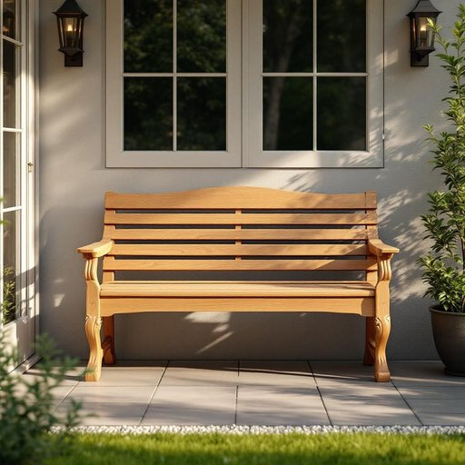

# bench

<h1 style="font-size: 2.5em; font-weight: 300; letter-spacing: 2px; margin: 0; color: #2c3e50;">
/bɛnʧ/
</h1>

---

---

## 例句

After we finished assembling the garden bench, which was made of sturdy oak and featured intricately carved legs, we decided to place it near the patio door where it would not only provide a comfortable spot to sit and enjoy the morning sun but also serve as a charming focal point amidst the array of potted plants and decorative lanterns.

*After(/ˈæftər/) we(/wi/) finished(/ˈfɪnɪʃt/) assembling(/əˈsɛmbəlɪŋ/) the(/ðə/) garden(/ˈgɑrdən/) bench,(/bɛnʧ,/) which(/wɪʧ/) was(/wɑz/) made(/meɪd/) of(/əv/) sturdy(/ˈstərdi/) oak(/oʊk/) and(/ənd/) featured(/ˈfiʧərd/) intricately(/ˈɪntrəkətli/) carved(/kɑrvd/) legs,(/lɛgz,/) we(/wi/) decided(/ˌdɪˈsaɪdɪd/) to(/tɪ/) place(/pleɪs/) it(/ɪt/) near(/nɪr/) the(/ðə/) patio(/ˈpætiˌoʊ/) door(/dɔr/) where(/wɛr/) it(/ɪt/) would(/wʊd/) not(/nɑt/) only(/ˈoʊnli/) provide(/prəˈvaɪd/) a(/ə/) comfortable(/ˈkəmfərtəbəl/) spot(/spɑt/) to(/tɪ/) sit(/sɪt/) and(/ənd/) enjoy(/ˌɛnˈʤɔɪ/) the(/ðə/) morning(/ˈmɔrnɪŋ/) sun(/sən/) but(/bət/) also(/ˈɔlsoʊ/) serve(/sərv/) as(/ɛz/) a(/ə/) charming(/ˈʧɑrmɪŋ/) focal(/ˈfoʊkəl/) point(/pɔɪnt/) amidst(/əˈmɪdst/) the(/ðə/) array(/əreɪ/) of(/əv/) potted(/ˈpɑtɪd/) plants(/plænts/) and(/ənd/) decorative(/ˈdɛkrətɪv/) lanterns.(/ˈlæntərnz./)*

**翻译：** 我们组装好那张由坚固橡木制成、雕有精美腿部花纹的花园长椅后，决定把它放置在通往露台的门旁，不仅为我们提供一个舒适的座位享受晨光，也成为盆栽植物和装饰灯笼之间一个别致的视觉焦点。

---

## 解释

英语单词“bench”作为名词，在家居生活用品的语境中通常指一种长椅，常见于室内或室外场所，如花园、门廊、厨房或餐厅等地方，一般为木制、金属或塑料材料制成，供多人坐用。使用时常见搭配有“wooden bench”（木制长椅）、“garden bench”（花园长椅）或“park bench”（公园长椅），学习者应注意“bench”是可数名词，复数形式为“benches”，且不可与单数不可数混淆。句子中作主语或宾语均常见，例如“The bench is by the window.”此外，“bench”在法律、体育等领域有特殊含义，但在家居用品语境中仅指座椅。词源方面，“bench”源自古英语“benc”，意为长凳或长椅，历史上多用于教堂或集会场所，后来泛指各种长椅。中文中精准对应为“长凳”或“长椅”，表达的是一种简洁、实用的座位，不带褒贬色彩，属于常见且基础的家具名词。值得注意的是，在某些文化背景下，长凳可能暗示休闲、社交或等待的场所氛围，但本身词义中无褒贬或特殊感情色彩。

---

<small style="color: #999; font-size: 0.9em;">2025-07-27 09:14:04</small>

