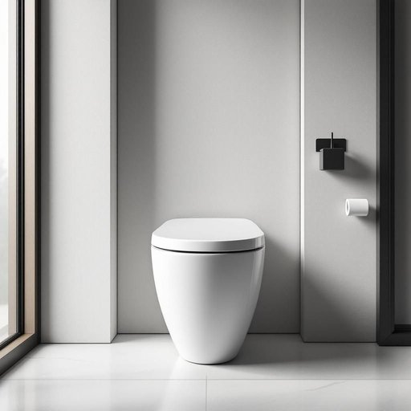

# bidet

<h1 style="font-size: 2.5em; font-weight: 300; letter-spacing: 2px; margin: 0; color: #2c3e50;">
/bidet*/
</h1>

---

---

## 例句

Although the bathroom was originally designed without a bidet, we decided to install one last month because, after reading numerous reviews praising its hygienic benefits and water-saving features, we realized it would be a worthwhile addition to our daily routine, especially during the colder months when using just toilet paper feels less comfortable.

*Although(/ˌɔlˈðoʊ/) the(/ðə/) bathroom(/ˈbæθˌrum/) was(/wɑz/) originally(/ərˈɪʤənəli/) designed(/dɪˈzaɪnd/) without(/wɪˈθaʊt/) a(/ə/) bidet,(/bidet*,/) we(/wi/) decided(/ˌdɪˈsaɪdɪd/) to(/tɪ/) install(/ˌɪnˈstɔl/) one(/wən/) last(/læst/) month(/mənθ/) because,(/bɪˈkəz,/) after(/ˈæftər/) reading(/ˈrɛdɪŋ/) numerous(/ˈnumərəs/) reviews(/rəvˈjuz/) praising(/ˈpreɪzɪŋ/) its(/ɪts/) hygienic(/hygienic*/) benefits(/ˈbɛnəfɪts/) and(/ənd/) water-saving(/water-saving*/) features,(/ˈfiʧərz,/) we(/wi/) realized(/ˈriəˌlaɪzd/) it(/ɪt/) would(/wʊd/) be(/bi/) a(/ə/) worthwhile(/ˈwərθˈwaɪl/) addition(/əˈdɪʃən/) to(/tɪ/) our(/ɑr/) daily(/ˈdeɪli/) routine,(/ruˈtin,/) especially(/əˈspɛʃəli/) during(/ˈdʊrɪŋ/) the(/ðə/) colder(/ˈkoʊldər/) months(/mənθs/) when(/wɪn/) using(/ˈjuzɪŋ/) just(/ʤɪst/) toilet(/ˈtɔɪlət/) paper(/ˈpeɪpər/) feels(/filz/) less(/lɛs/) comfortable.(/ˈkəmfərtəbəl./)*

**翻译：** 虽然浴室最初设计时没有配备坐浴盆，但上个月我们决定安装一个，因为在阅读了大量赞扬其卫生优势和节水功能的评价后，我们意识到它会成为日常生活中值得添加的设施，尤其是在使用厕纸感觉不够舒适的寒冷季节。

---

## 解释

英语单词“bidet”作为名词，指的是一种安装在浴室内用来清洗私密部位的小型卫生洁具，通常是椭圆形或盆状，带有喷水装置，使用时可代替或补充卫生纸。它常见于家庭生活中，特别是在欧洲、拉丁美洲和部分亚洲国家的卫生间里，用于保持个人清洁和卫生，适用于日常洗涤或特殊需求如妇女经期或产后护理。英语学习者使用该词时需注意其发音为/ˈbiː.deɪ/，词性固定为名词，常见搭配有“a bidet installed”，“use the bidet”，“bidet seat”等，通常不作复数形式“bidets”用以指多台设备，且多用于正式或技术描述的语境中。此外，bidet在表达技巧上，常作为生活设施出现，很少用于隐喻或引申义。词源上，“bidet”源自法国，原意是一种被训练骑的小马，因使用姿势相似而得名，后来引申为这种专门清洗身体的设备。中文语境中，“bidet”通常准确翻译为“坐浴盆”或“洗净器”，其含义带有较强的卫生和私密性，通常没有褒贬色彩，但在不同文化中其使用频率和接受度差异较大，部分文化中此设备较为罕见，可能被视为奢侈或特殊卫生习惯的象征，因此理解时需结合具体文化背景。

---

<small style="color: #999; font-size: 0.9em;">2025-07-27 09:14:04</small>

