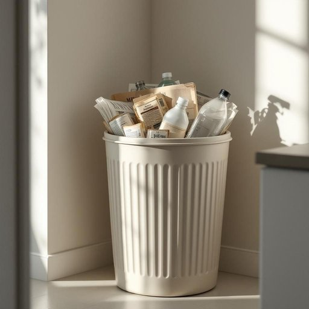

# bin

<h1 style="font-size: 2.5em; font-weight: 300; letter-spacing: 2px; margin: 0; color: #2c3e50;">
/bɪn/
</h1>

---

---

## 例句

Could you please take out the recycling from the bin in the kitchen, which is overflowing with plastic bottles and old newspapers, before the rubbish collection comes tomorrow morning?

*Could(/kʊd/) you(/ju/) please(/pliz/) take(/teɪk/) out(/aʊt/) the(/ðə/) recycling(/riˈsaɪkəlɪŋ/) from(/frəm/) the(/ðə/) bin(/bɪn/) in(/ɪn/) the(/ðə/) kitchen,(/ˈkɪʧən,/) which(/wɪʧ/) is(/ɪz/) overflowing(/ˈoʊvərˌfloʊɪŋ/) with(/wɪθ/) plastic(/ˈplæstɪk/) bottles(/ˈbɑtəlz/) and(/ənd/) old(/oʊld/) newspapers,(/ˈnuzˌpeɪpərz,/) before(/ˌbiˈfɔr/) the(/ðə/) rubbish(/ˈrəbɪʃ/) collection(/kəˈlɛkʃən/) comes(/kəmz/) tomorrow(/təˈmɑˌroʊ/) morning?(/ˈmɔrnɪŋ?/)*

**翻译：** 请您在明天早晨垃圾收集前，将厨房垃圾桶中装满塑料瓶和旧报纸的可回收物取出。

---

## 解释

英语单词“bin”作为名词在家居生活用品场景中通常指的是用于存放或收纳物品的容器，尤其是垃圾桶、储物箱或垃圾箱。具体使用场合多见于厨房、浴室、车库等生活空间，例如“dustbin”（垃圾桶）、“recycling bin”（回收箱）、“storage bin”（储物箱）等，常用于表达放置废弃物或分类收纳物品的器具。英语学习者在使用“bin”时需注意它通常为可数名词，且常搭配具体的修饰词或用作复合词构成特定意义（如“bin liner”垃圾袋、“bin bag”垃圾袋等），此外，强调环保分类时会根据后缀词区分垃圾种类；语法上，“bin”前可用定冠词或不定冠词，也可直接复数形式“bins”表示多个容器。词源方面，“bin”源自中古英语，早期指用于储存谷物或其他物品的大桶或箱子，原意为储存器皿，逐渐引申为各种收纳容器，包括现代意义上的垃圾桶。中文环境中，“bin”常被译作“垃圾桶”、“储物箱”或“箱子”，需根据具体语境灵活理解，避免简单等同为“箱子”导致混淆。该词本身无贬义或褒义色彩，属于中性日常用语，但在特定环保语境中，“bin”相关组合词可能涵盖对环境保护的关注，具有积极的文化内涵。综上，“bin”在家居生活中是指多功能的收纳或废弃物容器，使用时结合具体搭配和场景，理解其历史发展和文化背景，有助于准确掌握该词的实际应用。

---

<small style="color: #999; font-size: 0.9em;">2025-07-27 09:14:04</small>

