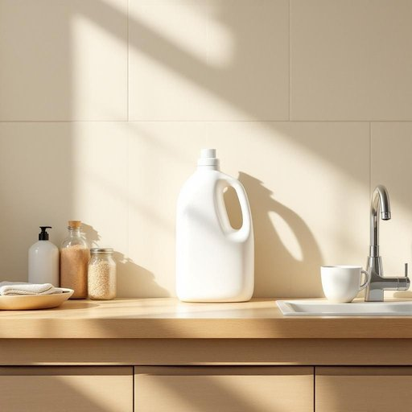

# bleach

<h1 style="font-size: 2.5em; font-weight: 300; letter-spacing: 2px; margin: 0; color: #2c3e50;">
/bliʧ/
</h1>

---

---

## 例句

Could you please check under the sink for the bleach bottle that’s stronger than the usual detergent, because the stubborn stains on the kitchen tiles, which haven’t come off despite several scrubbings, really need something more effective to get them completely clean?

*Could(/kʊd/) you(/ju/) please(/pliz/) check(/ʧɛk/) under(/ˈəndər/) the(/ðə/) sink(/sɪŋk/) for(/fər/) the(/ðə/) bleach(/bliʧ/) bottle(/ˈbɑtəl/) that’s(/that’s*/) stronger(/ˈstrɔŋgər/) than(/ðən/) the(/ðə/) usual(/ˈjuʒəwəl/) detergent,(/dɪˈtərʤənt,/) because(/bɪˈkəz/) the(/ðə/) stubborn(/ˈstəbərn/) stains(/steɪnz/) on(/ɔn/) the(/ðə/) kitchen(/ˈkɪʧən/) tiles,(/taɪlz,/) which(/wɪʧ/) haven’t(/haven’t*/) come(/kəm/) off(/ɔf/) despite(/dɪˈspaɪt/) several(/ˈsɛvərəl/) scrubbings,(/scrubbings*,/) really(/ˈrɪli/) need(/nid/) something(/ˈsəmθɪŋ/) more(/mɔr/) effective(/ˈifɛktɪv/) to(/tɪ/) get(/gɪt/) them(/ðɛm/) completely(/kəmˈplitli/) clean?(/klin?/)*

**翻译：** 请您帮忙检查一下水槽下是否有比普通清洁剂更强效的漂白剂，因为厨房瓷砖上的顽固污渍已经用力擦洗多次仍未清除，确实需要更有效的清洁剂才能彻底清洁干净。

---

## 解释

“bleach”作为名词在家居生活用品场景中主要指漂白剂，一种用于去除衣物、织物或其他物品上的污渍、杀菌消毒的化学品，常见于洗衣和清洁过程中，尤其是在处理白色衣物时广泛使用。英语学习者在使用“bleach”作为名词时需注意其不可数性质，通常不直接加复数形式，但可用量词如“bottle of bleach”（一瓶漂白剂）来表达数量；此外，与其搭配的常见表达包括“bleach solution”（漂白液）、“chlorine bleach”（氯漂白剂）、“oxygen bleach”（氧漂白剂）等，使用时要注意根据具体成分选择词汇。语法上，“bleach”既可作为动词也可作为名词，需根据上下文判断，名词时多指具体的漂白产品，其动词形式表示漂白的动作。词源方面，“bleach”起源于中古英语“blech(e)n”，进一步源自古英语“blǣcan”，意为使变白，这反映了漂白剂使物体颜色变浅甚至变白的本质功能。在中文语境中，“bleach”准确翻译为“漂白剂”，强调其化学清洁和美白的用途，通常无贬义，但因其含有较强的化学成分，使用时需注意安全，避免对皮肤或衣物造成损害。总的来说，作为家庭清洁用品的“bleach”是一种功能明确且常用的化学物质，理解其语法用法及搭配习惯有助于英语学习者在实际交流中准确表达漂白相关的概念和操作。

---

<small style="color: #999; font-size: 0.9em;">2025-07-27 09:14:04</small>

