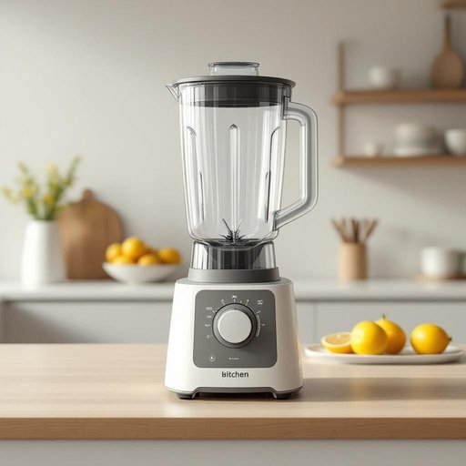

# blender

<h1 style="font-size: 2.5em; font-weight: 300; letter-spacing: 2px; margin: 0; color: #2c3e50;">
/ˈblɛndər/
</h1>

---

---

## 例句

Before we start preparing the smoothie, could you please check if the blender, which Mum bought last summer and is known for its exceptionally quiet motor and multiple speed settings, is plugged in and ready to use on the kitchen counter?

*Before(/ˌbiˈfɔr/) we(/wi/) start(/stɑrt/) preparing(/pərˈpɛrɪŋ/) the(/ðə/) smoothie,(/smoothie*,/) could(/kʊd/) you(/ju/) please(/pliz/) check(/ʧɛk/) if(/ɪf/) the(/ðə/) blender,(/ˈblɛndər,/) which(/wɪʧ/) Mum(/məm/) bought(/bɔt/) last(/læst/) summer(/ˈsəmər/) and(/ənd/) is(/ɪz/) known(/noʊn/) for(/fər/) its(/ɪts/) exceptionally(/ɪkˈsɛpʃənəli/) quiet(/kwaɪət/) motor(/ˈmoʊtər/) and(/ənd/) multiple(/ˈməltəpəl/) speed(/spid/) settings,(/ˈsɛtɪŋz,/) is(/ɪz/) plugged(/pləgd/) in(/ɪn/) and(/ənd/) ready(/ˈrɛdi/) to(/tɪ/) use(/juz/) on(/ɔn/) the(/ðə/) kitchen(/ˈkɪʧən/) counter?(/ˈkaʊntər?/)*

**翻译：** 在我们开始准备奶昔之前，能否请你确认一下妈妈去年夏天买的那台搅拌机——以其极静音的马达和多档调速著称——是否已插好电，摆放在厨房台面上，准备好使用？

---

## 解释

英语单词“blender”作为家居生活用品中的名词，指的是一种电动搅拌机，主要用于厨房中将各种食材如水果、蔬菜、液体等进行搅拌、混合或打碎，制作果汁、奶昔、汤料或酱料等。使用场合多为家庭厨房、餐厅或食品加工环境，语境通常涉及食品制作、烹饪或饮品准备。英语学习者在使用“blender”时应注意它作为可数名词时需要加冠词，如a blender或the blender，且常与动词“use”，“turn on”，“clean”等搭配，例如“use a blender to make smoothies”。此外，“blender”还可与形容词连用，如“powerful blender”表示性能强劲的搅拌机。词源上，“blender”来源于动词“blend”，意为混合，将动词后缀“-er”加到“blend”后构成表示“执行混合动作的工具”或“装置”的名词，体现其功能特性。在中文语境中，“blender”精确翻译为“搅拌机”，这是厨房电器中非常常见且实用的一个品类，用于加工食材，强调其机械搅拌功能，语义中性，无贬义或特殊褒义色彩，仅作为一种专用工具名词存在。文化上，“blender”代表了现代厨房设备的便利性和效率提升，体现了生活品质的提升。

---

<small style="color: #999; font-size: 0.9em;">2025-07-27 09:14:04</small>

