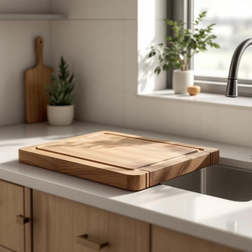

# board

<h1 style="font-size: 2.5em; font-weight: 300; letter-spacing: 2px; margin: 0; color: #2c3e50;">
/bɔrd/
</h1>

---

---

## 例句

Could you please pass me the chopping board that’s next to the sink, the one with those deep grooves along its edges, because I need something sturdy to prepare the vegetables for tonight’s dinner while keeping the countertop clean?

*Could(/kʊd/) you(/ju/) please(/pliz/) pass(/pæs/) me(/mi/) the(/ðə/) chopping(/ˈʧɑpɪŋ/) board(/bɔrd/) that’s(/that’s*/) next(/nɛkst/) to(/tɪ/) the(/ðə/) sink,(/sɪŋk,/) the(/ðə/) one(/wən/) with(/wɪθ/) those(/ðoʊz/) deep(/dip/) grooves(/gruvz/) along(/əˈlɔŋ/) its(/ɪts/) edges,(/ˈɛʤɪz,/) because(/bɪˈkəz/) I(/aɪ/) need(/nid/) something(/ˈsəmθɪŋ/) sturdy(/ˈstərdi/) to(/tɪ/) prepare(/priˈpɛr/) the(/ðə/) vegetables(/ˈvɛʤtəbəlz/) for(/fər/) tonight’s(/tonight’s*/) dinner(/ˈdɪnər/) while(/waɪl/) keeping(/ˈkipɪŋ/) the(/ðə/) countertop(/ˈkaʊntərˌtɑp/) clean?(/klin?/)*

**翻译：** 你能把放在水槽旁边的那个砧板递给我吗？就是那块边缘有深槽的，因为我需要一个结实的砧板来准备今晚的晚餐蔬菜，同时保持台面整洁。

---

## 解释

英语单词"board"在家居生活用品语境中作为名词，通常指的是“板”或“木板”，如用于家具制作的木板、厨房里的切菜板（cutting board）、以及用于支撑或固定物品的平坦硬质面板。在具体使用场合中，"board"可以指厨房中切菜用的板子、家里用的隔板、或墙面装饰板等，体现其作为平板形态的实物属性。英语学习者在使用时需注意"board"作为名词时通常为可数名词，常见搭配如"cutting board"（切菜板）、"blackboard"（黑板，与家庭学习空间相关）、"floorboard"（地板板条）等；在表达技巧上，区分"board"作为整体板材与具体功用物品的含义十分重要，避免与动词"board"（登上）混淆。词源方面，"board"源自古英语“bord”，原指木制桌子或板子，反映其最初作为家具或用具基础材质的含义，这一词源背景帮助理解其在家居环境中应用的多样性。在中文语境中，"board"多准确翻译为“板”“木板”“菜板”等具体名词，强调其平整且坚硬的物理特性，无特殊褒贬含义，但作为家用品，其体现了实用性和基础性的文化内涵，是生活中常见且必要的工具或材料。因此，理解“board”一词的基本物理形态及用途，有助于英语学习者准确把握其在家居用品语境中的多样表达与应用。

---

<small style="color: #999; font-size: 0.9em;">2025-07-27 09:14:04</small>

