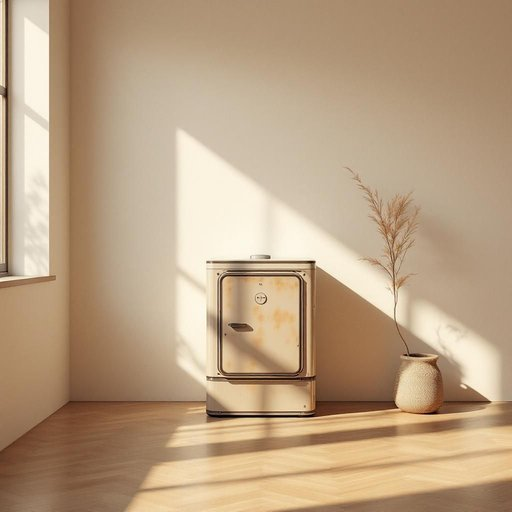

# boiler

<h1 style="font-size: 2.5em; font-weight: 300; letter-spacing: 2px; margin: 0; color: #2c3e50;">
/ˈbɔɪlər/
</h1>

---

---

## 例句

The plumber warned us that if we don’t replace the old boiler, which has been breaking down increasingly frequently and causing uneven heating throughout the house, we might end up facing not only higher energy bills but also potential damage to the entire central heating system during the winter months.

*The(/ðə/) plumber(/ˈpləmər/) warned(/wɔrnd/) us(/ˈjuˈɛs/) that(/ðət/) if(/ɪf/) we(/wi/) don’t(/don’t*/) replace(/ˌriˈpleɪs/) the(/ðə/) old(/oʊld/) boiler,(/ˈbɔɪlər,/) which(/wɪʧ/) has(/həz/) been(/bɪn/) breaking(/ˈbreɪkɪŋ/) down(/daʊn/) increasingly(/ˌɪnˈkrisɪŋgli/) frequently(/ˈfrikwɛntli/) and(/ənd/) causing(/ˈkɔzɪŋ/) uneven(/əˈnivən/) heating(/ˈhitɪŋ/) throughout(/θruaʊt/) the(/ðə/) house,(/haʊs,/) we(/wi/) might(/maɪt/) end(/ɛnd/) up(/əp/) facing(/ˈfeɪsɪŋ/) not(/nɑt/) only(/ˈoʊnli/) higher(/haɪər/) energy(/ˈɛnərʤi/) bills(/bɪlz/) but(/bət/) also(/ˈɔlsoʊ/) potential(/pəˈtɛnʃəl/) damage(/ˈdæmɪʤ/) to(/tɪ/) the(/ðə/) entire(/ɪnˈtaɪər/) central(/ˈsɛntrəl/) heating(/ˈhitɪŋ/) system(/ˈsɪstəm/) during(/ˈdʊrɪŋ/) the(/ðə/) winter(/ˈwɪntər/) months.(/mənθs./)*

**翻译：** 水管工警告我们，如果不更换那台频繁故障且导致全屋供暖不均的老旧锅炉，冬季不仅能源费用会大幅增加，还有可能损坏整个中央供暖系统。

---

## 解释

“boiler”作为名词在家居生活用品的语境中，通常指的是用来加热水或供应热水的装置，如热水锅炉或家用热水器，常见于供暖系统或生活热水系统中。使用场合多见于谈论家庭采暖、维修热水设备或安装热水系统时，例如“the boiler is broken”（锅炉坏了）或者“need to install a new boiler”（需要安装新锅炉）。英语学习者在使用时应注意“boiler”通常是可数名词，指具体的锅炉设备，可以与定冠词the连用，也可用复数形式boilers指多台设备，常见搭配有“boiler room”（锅炉房）、“boiler system”（锅炉系统）、“boiler maintenance”（锅炉维护）等，表达时要区别其作为生产设备的概念与其他含义，如“electric boiler”（电热水锅炉）等。词源上，“boiler”源自动词“boil”（煮沸），加上名词后缀“-er”，即指进行“煮沸”动作的装置，反映了其加热水的功能，最早约16世纪便见于英语中。中文语境下“boiler”可准确翻译为“锅炉”或“热水锅炉”，强调其加热供热的功能，日常理解多与家庭供暖或生活热水相关，无褒贬色彩，也无特殊文化内涵，属于较为中性且专业的生活用语。

---

<small style="color: #999; font-size: 0.9em;">2025-07-27 09:14:04</small>

