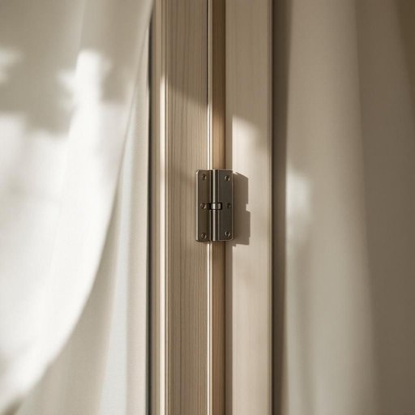

# bolt

<h1 style="font-size: 2.5em; font-weight: 300; letter-spacing: 2px; margin: 0; color: #2c3e50;">
/boʊlt/
</h1>

---

---

## 例句

Before we hang the new curtains, make sure to check if the bolt on the window latch is properly secured, because without it, even the slightest breeze could cause the sash to rattle noisily against the frame.

*Before(/ˌbiˈfɔr/) we(/wi/) hang(/hæŋ/) the(/ðə/) new(/nu/) curtains,(/ˈkərtənz,/) make(/meɪk/) sure(/ʃʊr/) to(/tɪ/) check(/ʧɛk/) if(/ɪf/) the(/ðə/) bolt(/boʊlt/) on(/ɔn/) the(/ðə/) window(/ˈwɪndoʊ/) latch(/læʧ/) is(/ɪz/) properly(/ˈprɑpərli/) secured,(/sɪˈkjʊrd,/) because(/bɪˈkəz/) without(/wɪˈθaʊt/) it,(/ɪt,/) even(/ˈivɪn/) the(/ðə/) slightest(/sˈlaɪtəst/) breeze(/briz/) could(/kʊd/) cause(/kɔz/) the(/ðə/) sash(/sæʃ/) to(/tɪ/) rattle(/ˈrætəl/) noisily(/ˈnɔɪzəli/) against(/əˈgɛnst/) the(/ðə/) frame.(/freɪm./)*

**翻译：** 在挂上新窗帘之前，请务必检查窗户闩锁上的螺栓是否已牢固固定，因为如果没有它，即使是最轻微的微风也可能使窗扇在窗框上发出噼啪作响的声音。

---

## 解释

英语单词bolt作为名词在家居生活用品的语境中，通常指的是一种金属制的紧固件，用来连接或固定家具、门窗等部件，比如门栓、螺栓或插销。具体使用场合多见于需要保障结构稳固或安全性的场合，如门上的滑动门栓、家具组装时用到的螺栓等。英语学习者使用bolt时需注意其作为可数名词时常与动词turn（旋转）、slide（滑动）搭配，如slide the bolt（推开门栓）、tighten the bolt（拧紧螺栓），且在表达位置时常用lock the bolt（锁上门栓）。其词源源于中古英语bolt，源自古英语bolt或bolt（箭头），原意为箭矢，后来引申为能迅速插入或锁定的金属件，体现其固定或锁闭的功能。在中文语境中，bolt多译为门闩、插销或螺栓，具体翻译依物品功能和形态而定，表示用以锁紧或固定的五金件。该词在家居生活中无褒贬色彩，属中性词汇，主要强调实用功能和结构安全性，使用时注意区别于动词bolt（冲出、逃跑）等其他含义，以避免语义混淆。

---

<small style="color: #999; font-size: 0.9em;">2025-07-27 09:14:04</small>

