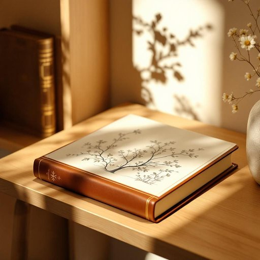

# book

<h1 style="font-size: 2.5em; font-weight: 300; letter-spacing: 2px; margin: 0; color: #2c3e50;">
/bʊk/
</h1>

---

---

## 例句

While organizing the shelves, I discovered the book, whose intricate leather binding and detailed illustrations captivated me, and since I had bought it from that quaint little bookstore down the road, it brought back a wave of nostalgia as I read by the warm glow of the lamp.

*While(/waɪl/) organizing(/ˈɔrgəˌnaɪzɪŋ/) the(/ðə/) shelves,(/ʃɛlvz,/) I(/aɪ/) discovered(/dɪˈskəvərd/) the(/ðə/) book,(/bʊk,/) whose(/huz/) intricate(/ˈɪntrəkət/) leather(/ˈlɛðər/) binding(/ˈbaɪndɪŋ/) and(/ənd/) detailed(/dɪˈteɪld/) illustrations(/ˌɪləˈstreɪʃənz/) captivated(/ˈkæptɪˌveɪtɪd/) me,(/mi,/) and(/ənd/) since(/sɪns/) I(/aɪ/) had(/hæd/) bought(/bɔt/) it(/ɪt/) from(/frəm/) that(/ðət/) quaint(/kweɪnt/) little(/ˈlɪtəl/) bookstore(/ˈbʊkˌstɔr/) down(/daʊn/) the(/ðə/) road,(/roʊd,/) it(/ɪt/) brought(/brɔt/) back(/bæk/) a(/ə/) wave(/weɪv/) of(/əv/) nostalgia(/nɔˈstælʤə/) as(/ɛz/) I(/aɪ/) read(/rɛd/) by(/baɪ/) the(/ðə/) warm(/wɔrm/) glow(/gloʊ/) of(/əv/) the(/ðə/) lamp.(/læmp./)*

**翻译：** 整理书架时，我发现了那本书，其精致的皮革装帧和细腻的插图深深吸引了我。由于它是我在那条街上那家古色古香的小书店买的，我在灯光温暖的光晕下阅读时，涌上心头的便是一阵浓浓的怀旧之情。

---

## 解释

英语单词book作为名词在家居生活用品的语境中，主要指的是以纸张装订成册的阅读材料，即我们常说的书。具体使用场合多见于描述家庭中摆放、使用或收藏的书籍，如书架上的书、茶几上的杂志、卧室里的小说等。在英语学习者使用时需注意，book作为可数名词，单数形式是book，复数形式为books，且前面通常会加冠词或数量词，如a book, two books；在表达时常见搭配包括read a book（读书）、borrow a book（借书）、bookshelf（书架）、book cover（书皮）等，这些搭配有助于准确描述书籍的使用和状态。该词源自古英语bōc，与字母和书写记载有关，最初指用木制薄板或树皮书写的记录，后来演变为现在的纸质书籍。中文语境下，book多被译为书，含义明确，指能够阅读的信息载体，兼具文化和知识传递的功能，无褒贬色彩，但在不同语境中可指学术书籍、小说、教科书等，体现文化和教育的属性，此外在家居用品中提及book时还隐含了家庭文化氛围或个人生活品味的象征意义。

---

<small style="color: #999; font-size: 0.9em;">2025-07-27 09:14:04</small>

