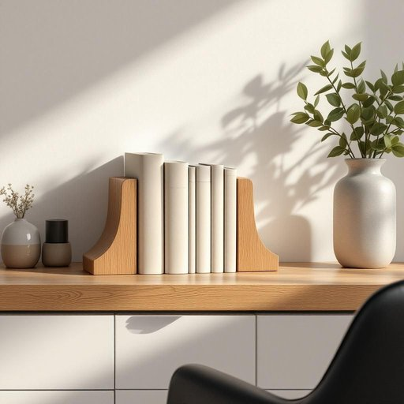

# bookend

<h1 style="font-size: 2.5em; font-weight: 300; letter-spacing: 2px; margin: 0; color: #2c3e50;">
/ˈbʊˌkɛnd/
</h1>

---

---

## 例句

Could you please move the antique bookend from the living room shelf to the study table, where it can not only hold my novels upright but also add a touch of vintage charm that complements the new oak desk and the leather armchair perfectly?

*Could(/kʊd/) you(/ju/) please(/pliz/) move(/muv/) the(/ðə/) antique(/ænˈtik/) bookend(/ˈbʊˌkɛnd/) from(/frəm/) the(/ðə/) living(/ˈlɪvɪŋ/) room(/rum/) shelf(/ʃɛlf/) to(/tɪ/) the(/ðə/) study(/ˈstədi/) table,(/ˈteɪbəl,/) where(/wɛr/) it(/ɪt/) can(/kən/) not(/nɑt/) only(/ˈoʊnli/) hold(/hoʊld/) my(/maɪ/) novels(/ˈnɑvəlz/) upright(/ˈəˌpraɪt/) but(/bət/) also(/ˈɔlsoʊ/) add(/æd/) a(/ə/) touch(/təʧ/) of(/əv/) vintage(/ˈvɪntɪʤ/) charm(/ʧɑrm/) that(/ðət/) complements(/ˈkɑmpləmənts/) the(/ðə/) new(/nu/) oak(/oʊk/) desk(/dɛsk/) and(/ənd/) the(/ðə/) leather(/ˈlɛðər/) armchair(/ˈɑrmˌʧɛr/) perfectly?(/ˈpərfəktli?/)*

**翻译：** 请您将客厅书架上的古董书挡移到书房的书桌上，不仅能够使我的小说书本直立摆放，还能为新的橡木书桌和皮质扶手椅增添一抹完美契合的复古韵味。

---

## 解释

英语单词“bookend”作为名词，在家居生活用品的语境中指的是放置在书架上用来固定一排书籍，使其立稳不倒的书挡或书靠。具体使用场合通常是在书架、桌面或办公区，当需要保护书籍不倒塌或方便整理时会使用书挡。英语学习者使用“bookend”时应注意它通常作可数名词，后面可以跟复数形式“bookends”，且常见搭配如“一对书挡”、金属/木质书挡、装饰性书挡等。此外，“bookend”在句中作主语、宾语或表语均很常见，如“The bookends kept the books upright.”词源方面，“bookend”由“book”（书）和“end”（端）组合而成，直观表达了其功能即书的两端支撑物，起源可追溯到19世纪末20世纪初的家具及家居用品发展时期。中文语境中准确翻译为“书挡”或“书靠”，强调其物理功能，且无褒贬色彩或特殊文化内涵，仅作为实用的家居用品词汇出现，使用时不含比喻义或其他引申义。整体来看，“bookend”在家居生活中是一种常见且功能明确的工具，适合英语学习者在描述书籍收纳与整理时灵活运用。

---

<small style="color: #999; font-size: 0.9em;">2025-07-27 09:14:04</small>

