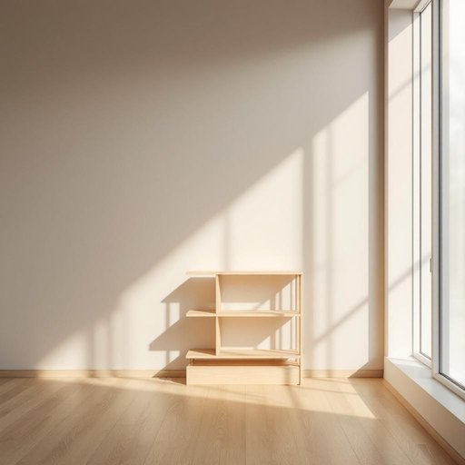

# bookshelf

<h1 style="font-size: 2.5em; font-weight: 300; letter-spacing: 2px; margin: 0; color: #2c3e50;">
/ˈbʊkˌʃɛlf/
</h1>

---

---

## 例句

After rearranging the living room to create more space for guests, she decided that the old, rickety bookshelf by the window, which had been gathering dust for years, would be perfect for displaying the new collection of classic novels and family photo albums that she’d recently inherited.

*After(/ˈæftər/) rearranging(/ˌriərˈeɪnʤɪŋ/) the(/ðə/) living(/ˈlɪvɪŋ/) room(/rum/) to(/tɪ/) create(/kriˈeɪt/) more(/mɔr/) space(/speɪs/) for(/fər/) guests,(/gɛsts,/) she(/ʃi/) decided(/ˌdɪˈsaɪdɪd/) that(/ðət/) the(/ðə/) old,(/oʊld,/) rickety(/ˈrɪkəti/) bookshelf(/ˈbʊkˌʃɛlf/) by(/baɪ/) the(/ðə/) window,(/ˈwɪndoʊ,/) which(/wɪʧ/) had(/hæd/) been(/bɪn/) gathering(/ˈgæðərɪŋ/) dust(/dəst/) for(/fər/) years,(/jɪrz,/) would(/wʊd/) be(/bi/) perfect(/ˈpərˌfɪkt/) for(/fər/) displaying(/dɪˈspleɪɪŋ/) the(/ðə/) new(/nu/) collection(/kəˈlɛkʃən/) of(/əv/) classic(/ˈklæsɪk/) novels(/ˈnɑvəlz/) and(/ənd/) family(/ˈfæməli/) photo(/ˈfoʊˌtoʊ/) albums(/ˈælbəmz/) that(/ðət/) she’d(/she’d*/) recently(/ˈrisəntli/) inherited.(/ˌɪnˈhɛrətɪd./)*

**翻译：** 在重新布置客厅以腾出更多空间招待客人后，她决定将窗边那座多年来积满灰尘的破旧书架用来陈列她最近继承的新藏经典小说和家庭相册，觉得再合适不过了。

---

## 解释

英语单词“bookshelf”作为名词，主要指用于存放书籍的家具，即“书架”，通常出现在家居生活用品的语境中，比如家庭、图书馆、办公室等场合，用于陈列或整理书本。英语学习者在使用“bookshelf”时应注意它是可数名词，复数形式为“bookshelves”，且常与表示数量、位置或修饰性质的词搭配，如“一只木制书架”“挂墙书架”或“一排书架”。此外，“bookshelf”一般不直接与动词连用，而是作为存储地点出现，例如“把书放在书架上”。词源上，“bookshelf”由“book”和“shelf”复合而成，直观表达了其功能属性，无特殊隐喻或文化色彩。中文语境中应理解为“书架”，指专门用于摆放书籍的架子，概念明确且无褒贬含义，属于日常生活中的常见家具名称，使用时需根据具体场合选择合适的修饰词以表达材质、位置或风格等细节。

---

<small style="color: #999; font-size: 0.9em;">2025-07-27 09:14:04</small>

