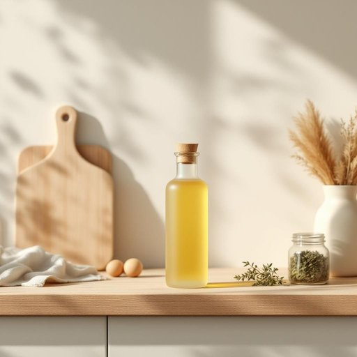

# bottle

<h1 style="font-size: 2.5em; font-weight: 300; letter-spacing: 2px; margin: 0; color: #2c3e50;">
/ˈbɑtəl/
</h1>

---

---

## 例句

Could you please pass me the bottle of olive oil that is sitting on the kitchen counter next to the cutting board and the jar of dried herbs so I can drizzle some over the salad before we start eating?

*Could(/kʊd/) you(/ju/) please(/pliz/) pass(/pæs/) me(/mi/) the(/ðə/) bottle(/ˈbɑtəl/) of(/əv/) olive(/ˈɑlɪv/) oil(/ɔɪl/) that(/ðət/) is(/ɪz/) sitting(/ˈsɪtɪŋ/) on(/ɔn/) the(/ðə/) kitchen(/ˈkɪʧən/) counter(/ˈkaʊntər/) next(/nɛkst/) to(/tɪ/) the(/ðə/) cutting(/ˈkətɪŋ/) board(/bɔrd/) and(/ənd/) the(/ðə/) jar(/ʤɑr/) of(/əv/) dried(/draɪd/) herbs(/ərbz/) so(/soʊ/) I(/aɪ/) can(/kən/) drizzle(/ˈdrɪzəl/) some(/səm/) over(/ˈoʊvər/) the(/ðə/) salad(/ˈsæləd/) before(/ˌbiˈfɔr/) we(/wi/) start(/stɑrt/) eating?(/ˈitɪŋ?/)*

**翻译：** 你能把放在厨房柜台上、砧板和干香草罐子旁边的那瓶橄榄油递给我吗？这样我就可以在我们开始吃之前给沙拉淋上一些。

---

## 解释

英语单词“bottle”作为名词在家居生活用品的语境中，主要指用来装液体的容器，通常是玻璃、塑料或金属制成，具有狭窄的瓶颈方便控制倒出量，如水瓶、饮料瓶、香水瓶等。具体使用场合包括厨房储存调味品、饮料，浴室放洗发水或沐浴露，亦可用于储存医用液体等。在英语学习中，需要注意“bottle”作为可数名词时，单复数形式分别为“bottle”和“bottles”，且常见搭配有“一瓶水”(a bottle of water)、“玻璃瓶”(a glass bottle)、“塑料瓶”(plastic bottle)、“开瓶器”(bottle opener)等。此外，“to bottle up”作为动词短语，有“压抑情感”的比喻含义，使用时需区别其名词意义。词源方面，“bottle”源自中古英语“botel”，其根源可追溯至拉丁语“butticula”，意为容器，且与德语“Flasche”有同源关系，反映其作为容器的传统功能。在中文语境中，“bottle”准确理解为“瓶子”，强调其储存和携带液体的实用功能，无特殊褒贬色彩，但在特定表达中如“bottle up feelings”则带有情绪压抑的负面意味。整体上，“bottle”是一个通用且基础的名词，广泛结合不同材料、用途和场景，英语学习者应掌握其基本含义及常用搭配，以便正确理解和表达相关家居生活情境。

---

<small style="color: #999; font-size: 0.9em;">2025-07-27 09:14:04</small>

