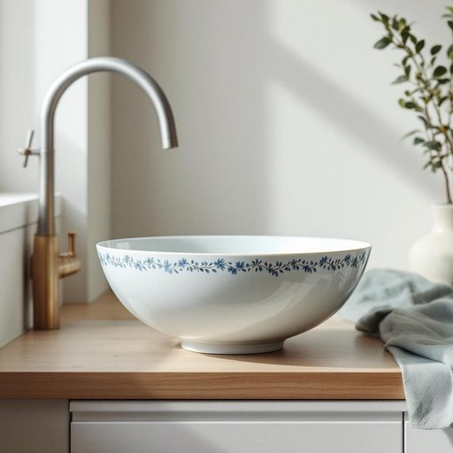

# bowl

<h1 style="font-size: 2.5em; font-weight: 300; letter-spacing: 2px; margin: 0; color: #2c3e50;">
/boʊl/
</h1>

---

---

## 例句

Could you please wash the large ceramic bowl that’s sitting next to the sink, the one with the intricate blue patterns around its rim, because I need it to mix the ingredients for the cake we're baking this afternoon?

*Could(/kʊd/) you(/ju/) please(/pliz/) wash(/wɑʃ/) the(/ðə/) large(/lɑrʤ/) ceramic(/sərˈæmɪk/) bowl(/boʊl/) that’s(/that’s*/) sitting(/ˈsɪtɪŋ/) next(/nɛkst/) to(/tɪ/) the(/ðə/) sink,(/sɪŋk,/) the(/ðə/) one(/wən/) with(/wɪθ/) the(/ðə/) intricate(/ˈɪntrəkət/) blue(/blu/) patterns(/ˈpætərnz/) around(/əraʊnd/) its(/ɪts/) rim,(/rɪm,/) because(/bɪˈkəz/) I(/aɪ/) need(/nid/) it(/ɪt/) to(/tɪ/) mix(/mɪks/) the(/ðə/) ingredients(/ˌɪnˈgridiənts/) for(/fər/) the(/ðə/) cake(/keɪk/) we're(/wɪr/) baking(/ˈbeɪkɪŋ/) this(/ðɪs/) afternoon?(/ˌæftərˈnun?/)*

**翻译：** 请帮忙清洗一下放在水槽旁的大瓷碗，就是那个碗边缘带有精致蓝色花纹的，因为我需要用它来拌匀我们今天下午要烤的蛋糕的材料。

---

## 解释

英语单词“bowl”作为名词在家居生活用品场景中通常指一种开口较大、边缘较低、形状类似碗的器皿，主要用于盛装食物或液体，如汤、沙拉、麦片、水果等。其具体使用场合多为餐桌上的日常饮食活动或厨房准备环节，如“a cereal bowl”（麦片碗）、“a soup bowl”（汤碗）等。在语法使用上，“bowl”作为可数名词，单复数形式分别为“bowl”和“bowls”，英语学习者应注意不可与动词“bowl”（投球）混淆，且在描述容量或材质时常见搭配有“a large bowl”（大碗）、“a ceramic bowl”（陶瓷碗）、“a mixing bowl”（搅拌碗）等。此外，常见表达还有“set the table with bowls and plates”（摆放碗盘餐具）等。该词来源于中古英语“bole”，最初指小木桶或容器，其词根可以追溯至古英语“bolla”，意为盛物的深碗或容器，反映出其形状与功能上的连续性。在中文语境中，“bowl”通常准确翻译为“碗”，强调的是器皿的功能性和形状，区别于盘子或碟子，且无特别的褒贬含义或隐喻色彩，仅表示一种日常生活中常见的盛食器皿，这一点与中文中“碗”的用法基本吻合，不含有特殊文化负载或情感色彩。

---

<small style="color: #999; font-size: 0.9em;">2025-07-27 09:14:04</small>

