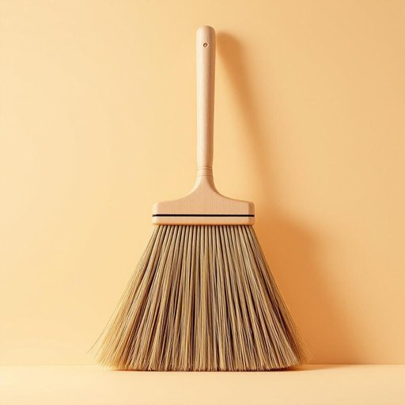

# broom

<h1 style="font-size: 2.5em; font-weight: 300; letter-spacing: 2px; margin: 0; color: #2c3e50;">
/brum/
</h1>

---

---

## 例句

The ancient manuscript, a priceless artifact stored carefully in the museum's vault, revealed intricate details about the civilization’s culture and daily life through the delicate drawings and cryptic symbols engraved on its brittle pages.

*The(/ðə/) ancient(/ˈeɪnʧənt/) manuscript,(/ˈmænjəˌskrɪpt,/) a(/ə/) priceless(/ˈpraɪsləs/) artifact(/ˈɑrtəˌfækt/) stored(/stɔrd/) carefully(/ˈkɛrfəli/) in(/ɪn/) the(/ðə/) museum's(/mjuˈziəmz/) vault,(/vɔlt,/) revealed(/rɪˈvild/) intricate(/ˈɪntrəkət/) details(/ˈditeɪlz/) about(/əˈbaʊt/) the(/ðə/) civilization’s(/civilization’s*/) culture(/ˈkəlʧər/) and(/ənd/) daily(/ˈdeɪli/) life(/laɪf/) through(/θru/) the(/ðə/) delicate(/ˈdɛləkət/) drawings(/drɔɪŋz/) and(/ənd/) cryptic(/ˈkrɪptɪk/) symbols(/ˈsɪmbəlz/) engraved(/ɪnˈgreɪvd/) on(/ɔn/) its(/ɪts/) brittle(/ˈbrɪtəl/) pages.(/ˈpeɪʤɪz./)*

**翻译：** 这份古老的手稿是博物馆保险库中精心保存的无价珍宝，通过其脆弱页页上精美的图画和神秘的符号，揭示了那个文明的文化和日常生活的细致细节。

---

## 解释

英语单词“broom”作为名词，在家居生活用品的语境中指的是一种用于清扫地面、尤其是地板的工具，通常由一把长柄和固定在一端的粗硬刷毛组成，适用于扫除尘土、垃圾等杂物。具体使用场合多见于家庭、办公室、学校等室内外环境的清洁活动中，例如“I use a broom to sweep the kitchen floor.”英语学习者在使用“broom”时应注意其为可数名词，常见搭配有“a broom and dustpan”（扫帚和簸箕）、“a straw broom”（稻草扫帚）、“to sweep with a broom”（用扫帚扫地）等表达，其中“broom”不可与“brush”混淆，brush多指带手柄且刷毛较短的刷子，而broom专指长柄扫帚。此外，broom常与动词“sweep”搭配使用，构成动宾结构。词源方面，“broom”一词源自古英语“brōm”，意指一种灌木植物，因最早的扫帚是用这种植物的枝条制成，逐渐引申为扫帚工具。文化上，broom在英语国家有时带有象征意义，比如在西方民间传说中，扫帚常与巫婆、魔法有关联，但在普通家居语境下无褒贬色彩。对应中文通常译为“扫帚”，准确理解为长柄的清扫用具，重点在于其功能性和工具属性，而非其他隐喻或文化含义。

---

<small style="color: #999; font-size: 0.9em;">2025-07-27 09:14:04</small>

