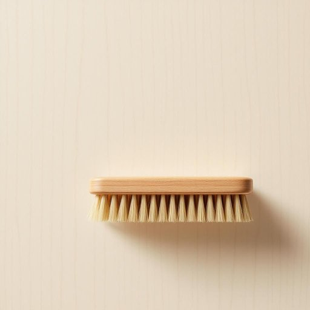

# brush

<h1 style="font-size: 2.5em; font-weight: 300; letter-spacing: 2px; margin: 0; color: #2c3e50;">
/brəʃ/
</h1>

---

---

## 例句

Before you start painting the living room walls, ensure that the stiff-bristled brush you retrieved from the cupboard next to the sink effectively cleans off the dust and cobwebs that have accumulated in the ceiling corners throughout the winter months.

*Before(/ˌbiˈfɔr/) you(/ju/) start(/stɑrt/) painting(/ˈpeɪnɪŋ/) the(/ðə/) living(/ˈlɪvɪŋ/) room(/rum/) walls,(/wɔlz,/) ensure(/ɪnˈʃʊr/) that(/ðət/) the(/ðə/) stiff-bristled(/stiff-bristled*/) brush(/brəʃ/) you(/ju/) retrieved(/riˈtrivd/) from(/frəm/) the(/ðə/) cupboard(/ˈkəbərd/) next(/nɛkst/) to(/tɪ/) the(/ðə/) sink(/sɪŋk/) effectively(/ˈifɛktɪvli/) cleans(/klinz/) off(/ɔf/) the(/ðə/) dust(/dəst/) and(/ənd/) cobwebs(/ˈkɑbˌwɛbz/) that(/ðət/) have(/hæv/) accumulated(/əˈkjumjəˌleɪtɪd/) in(/ɪn/) the(/ðə/) ceiling(/ˈsilɪŋ/) corners(/ˈkɔrnərz/) throughout(/θruaʊt/) the(/ðə/) winter(/ˈwɪntər/) months.(/mənθs./)*

**翻译：** 在开始粉刷客厅墙壁之前，请确保你从水槽旁的橱柜中取出的硬毛刷，能够有效清除冬季积累在天花板角落的灰尘和蛛网。

---

## 解释

英语单词“brush”作为名词在家居生活用品语境中通常指一种用来清洁、整理或修饰物体表面的工具，如牙刷（toothbrush）、刷子（cleaning brush）、发刷（hairbrush）等，这些刷子一般由刷毛和手柄组成，适用于清洁地板、家具、衣物或个人卫生。学习者在使用“brush”时需注意其不可数与可数的用法区别，通常指具体的刷子时为可数名词，如“a brush”，而泛指刷毛或刷子的概念时可作不可数名词。此外，“brush”常与不同的词结合形成复合词，如“toothbrush”、“hairbrush”、“paintbrush”等，掌握这些固定搭配有助于准确表达。语法上，作为名词，“brush”在句中可作主语、宾语或介词宾语，且其前可加量词（a/an、some）或数词。词源上，“brush”源自古英语“bryce”或“brysc”，意指簇或簇状物，反映其刷毛或簇状结构的特点，随着时间演变为指清洁或整理用具。中文语境中，“brush”通常译为“刷子”，根据具体功能不同又有牙刷、扫帚、刷毛等细分翻译，含义明确且无特别褒贬色彩，属于中性名词，但在实际使用中不得与特定专业或艺术用刷混淆。总体而言，“brush”作为家居用品名词，是指一类常见且不可或缺的清洁整理工具，理解其多样化用法和搭配对于英语学习者非常重要。

---

<small style="color: #999; font-size: 0.9em;">2025-07-27 09:14:04</small>

