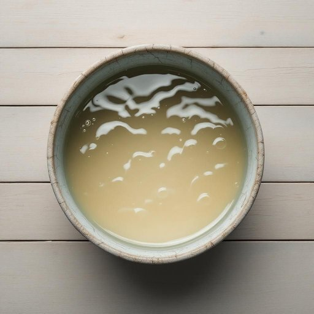

# bucket

<h1 style="font-size: 2.5em; font-weight: 300; letter-spacing: 2px; margin: 0; color: #2c3e50;">
/ˈbəkɪt/
</h1>

---

---

## 例句

Could you please fill that old, slightly cracked bucket with warm soapy water from the tap, so I can mop the kitchen floor properly before our guests arrive this evening?

*Could(/kʊd/) you(/ju/) please(/pliz/) fill(/fɪl/) that(/ðət/) old,(/oʊld,/) slightly(/sˈlaɪtli/) cracked(/krækt/) bucket(/ˈbəkɪt/) with(/wɪθ/) warm(/wɔrm/) soapy(/ˈsoʊpi/) water(/ˈwɔtər/) from(/frəm/) the(/ðə/) tap,(/tæp,/) so(/soʊ/) I(/aɪ/) can(/kən/) mop(/mɑp/) the(/ðə/) kitchen(/ˈkɪʧən/) floor(/flɔr/) properly(/ˈprɑpərli/) before(/ˌbiˈfɔr/) our(/ɑr/) guests(/gɛsts/) arrive(/əraɪv/) this(/ðɪs/) evening?(/ˈivnɪŋ?/)*

**翻译：** 您能否用水龙头的温暖肥皂水将那个有些破裂的旧水桶装满，好让我在今晚客人来之前好好拖一下厨房地板？

---

## 解释

英语单词“bucket”作为名词在家居生活用品语境中，指的是一种通常由塑料、金属或其他耐用材料制成的带有提手的圆柱形容器，主要用于盛水、清洗、储存或搬运液体和其他松散物品。具体使用场合包括家庭清洁如拖地倒水、园艺浇水、储物或日常生活中临时盛装东西等。英语学习者在使用“bucket”时应注意其不可数和可数用法的区分，通常作为可数名词出现，复数形式为“buckets”，且常见搭配有“a bucket of water”（一桶水）、“empty the bucket”（清空桶）等；此外，常有固定短语如“kick the bucket”表示“去世”，但这是习语，需区分字面和隐喻含义。词源方面，“bucket”源自古英语“buc(c)et”，与古弗兰克语“bukette”有关，原指一种容器，这体现了其基本的盛装功能和形态。中文语境中的准确翻译通常为“桶”，强调其盛装和运输液体或物品的功能，避免与水桶、提桶等同义词混淆时，根据具体功能适度调整翻译。该词在中文中无褒贬色彩，也无特殊文化内涵，属于日常生活中常用的普通名词。

---

<small style="color: #999; font-size: 0.9em;">2025-07-27 09:14:04</small>

