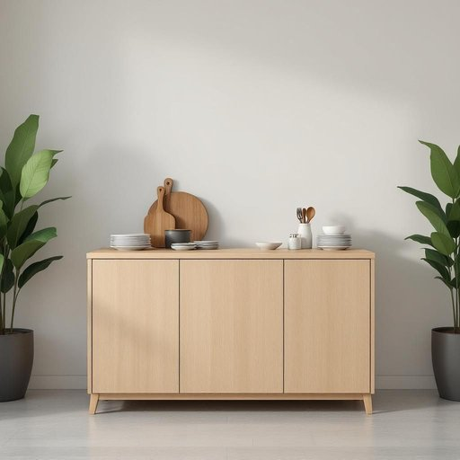

# buffet

<h1 style="font-size: 2.5em; font-weight: 300; letter-spacing: 2px; margin: 0; color: #2c3e50;">
/ˈbəfət/
</h1>

---

---

## 例句

The complexity of the architectural design challenged the engineering team, requiring innovative solutions to ensure the building's stability and aesthetic appeal under varying environmental conditions.

*The(/ðə/) complexity(/kəmˈplɛksɪti/) of(/əv/) the(/ðə/) architectural(/ˌɑrkəˈtɛkʧərəl/) design(/dɪˈzaɪn/) challenged(/ˈʧælənʤd/) the(/ðə/) engineering(/ˈɛnʤəˈnɪrɪŋ/) team,(/tim,/) requiring(/rikˈwaɪərɪŋ/) innovative(/ˈɪnəˌveɪtɪv/) solutions(/səˈluʃənz/) to(/tɪ/) ensure(/ɪnˈʃʊr/) the(/ðə/) building's(/ˈbɪldɪŋz/) stability(/stəˈbɪlɪti/) and(/ənd/) aesthetic(/ɛsˈθɛtɪk/) appeal(/əˈpil/) under(/ˈəndər/) varying(/ˈvɛriɪŋ/) environmental(/ɪnˌvaɪrənˈmɛnəl/) conditions.(/kənˈdɪʃənz./)*

**翻译：** 建筑设计的复杂性对工程团队提出了挑战，要求他们采用创新的解决方案，以确保建筑在多变的环境条件下既保持稳定性，又兼具美学魅力。

---

## 解释

英语单词“buffet”在家居生活用品场景中作为名词时，通常指一种低矮的带有储物柜或抽屉的家具，用于存放餐具、餐巾或供餐时使用的器皿和食物，常见于餐厅或饭厅里，作为端放食物或用具的表面。具体使用场合多为描述家中或餐厅的陈设，如“The buffet in the dining room holds all the plates and silverware”（饭厅里的餐柜摆放着所有盘子和银器）。英语学习者使用该词时需注意，“buffet”作为名词时发音为/ˈbʊfeɪ/或/ˈbʌfeɪ/（英式和美式略有差异），其复数形式为“buffets”，且常与“sideboard”或“cabinet”同义，搭配词汇如“buffet table”（自助餐台）、“dining buffet”等。在表达技巧上，需区分“buffet”作为名词表示家具与作动词意为“搏斗，击打”，语法和语义不同。词源上，“buffet”源自法语，原指餐厅或厨房中放置食物的家具，延伸自古法语“buffet”意为“打击，敲击”，后来引申为放置食物的台子。中文语境准确翻译时，“buffet”一般译为“餐柜”或“餐边柜”，指的是餐厅中用来存放餐具和摆放食物的家具，与“自助餐”意义上的“自助餐台”区分开来，需避免混淆“buffet”作“自助餐”时的用法。在家居语境中，这个词并无褒贬色彩，属于中性词汇，反映的是实用性家具的功能及陈设，是餐厅布局中较为正式且实用的一类家具。

---

<small style="color: #999; font-size: 0.9em;">2025-07-27 09:14:04</small>

