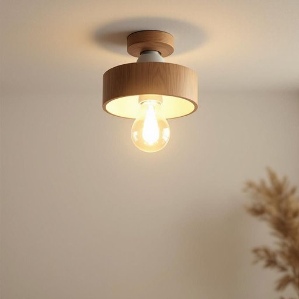

# bulb

<h1 style="font-size: 2.5em; font-weight: 300; letter-spacing: 2px; margin: 0; color: #2c3e50;">
/bəlb/
</h1>

---

---

## 例句

Before you start painting the living room, make sure to replace the old, flickering bulb in the ceiling lamp with a new energy-efficient one, as it not only brightens the space more effectively but also helps reduce electricity bills in the long run.

*Before(/ˌbiˈfɔr/) you(/ju/) start(/stɑrt/) painting(/ˈpeɪnɪŋ/) the(/ðə/) living(/ˈlɪvɪŋ/) room,(/rum,/) make(/meɪk/) sure(/ʃʊr/) to(/tɪ/) replace(/ˌriˈpleɪs/) the(/ðə/) old,(/oʊld,/) flickering(/ˈflɪkərɪŋ/) bulb(/bəlb/) in(/ɪn/) the(/ðə/) ceiling(/ˈsilɪŋ/) lamp(/læmp/) with(/wɪθ/) a(/ə/) new(/nu/) energy-efficient(/energy-efficient*/) one,(/wən,/) as(/ɛz/) it(/ɪt/) not(/nɑt/) only(/ˈoʊnli/) brightens(/ˈbraɪtənz/) the(/ðə/) space(/speɪs/) more(/mɔr/) effectively(/ˈifɛktɪvli/) but(/bət/) also(/ˈɔlsoʊ/) helps(/hɛlps/) reduce(/rɪˈdus/) electricity(/ɪˌlɛkˈtrɪsəti/) bills(/bɪlz/) in(/ɪn/) the(/ðə/) long(/lɔŋ/) run.(/rən./)*

**翻译：** 在开始粉刷客厅之前，请务必将吊灯中那个旧的闪烁灯泡更换为新的节能灯泡，这不仅能更有效地照亮空间，还能从长远来看帮助降低电费。

---

## 解释

英语单词bulb作为名词在家居生活用品场景中主要指灯泡，即用于照明的电灯泡，这种使用通常出现在谈论灯具的结构、维修或更换时，如light bulb（电灯泡）是最常见的搭配。使用时要注意，bulb是可数名词，复数形式为bulbs，且通常跟具体的灯具有直接关系，比如change the bulb（换灯泡）、a burnt-out bulb（烧坏的灯泡）。此外，bulb也可指植物的球茎，如tulip bulb（郁金香球茎），但在家居用品语境中多指灯泡。词源上，bulb源自拉丁语bulbus，意为鳞茎，因灯泡形状类似洋葱球茎而得名，这种形象化命名使词义延伸至照明设备。中文通常翻译为灯泡或电灯泡，应避免混淆植物球茎的意义。bulb在日常家居用语中无褒贬色彩，也无特殊文化含义，是一个普通且常用的生活词汇。对英语学习者而言，掌握其常见搭配如light bulb、bulb holder（灯座）、energy-saving bulb（节能灯泡）等，有助于准确表达和理解实际生活中相关物品的描述。

---

<small style="color: #999; font-size: 0.9em;">2025-07-27 09:14:04</small>

