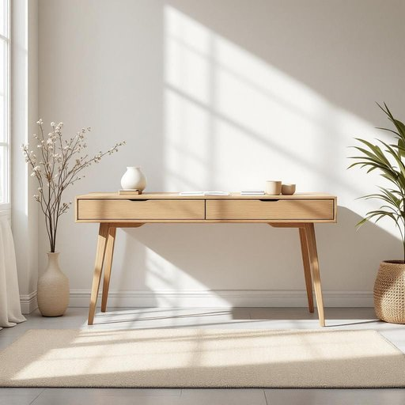

# bureau

<h1 style="font-size: 2.5em; font-weight: 300; letter-spacing: 2px; margin: 0; color: #2c3e50;">
/ˈbjʊroʊ/
</h1>

---

---

## 例句

Could you please help me move the old bureau from the living room into the study, since its deep drawers, which are perfect for organising paperwork and stationery, have become absolutely essential for keeping the clutter at bay?

*Could(/kʊd/) you(/ju/) please(/pliz/) help(/hɛlp/) me(/mi/) move(/muv/) the(/ðə/) old(/oʊld/) bureau(/ˈbjʊroʊ/) from(/frəm/) the(/ðə/) living(/ˈlɪvɪŋ/) room(/rum/) into(/ˈɪntu/) the(/ðə/) study,(/ˈstədi,/) since(/sɪns/) its(/ɪts/) deep(/dip/) drawers,(/drɔrz,/) which(/wɪʧ/) are(/ər/) perfect(/ˈpərˌfɪkt/) for(/fər/) organising(/organising*/) paperwork(/ˈpeɪpərˌwərk/) and(/ənd/) stationery,(/ˈsteɪʃəˌnɛri,/) have(/hæv/) become(/bɪˈkəm/) absolutely(/ˌæbsəˈlutli/) essential(/ɛˈsɛnʃəl/) for(/fər/) keeping(/ˈkipɪŋ/) the(/ðə/) clutter(/ˈklətər/) at(/æt/) bay?(/beɪ?/)*

**翻译：** 您能帮我把客厅里的旧办公柜搬到书房吗？它那深而宽敞的抽屉非常适合整理文件和文具，已成为保持整洁不可或缺的利器。

---

## 解释

英语单词“bureau”在家居生活用品的语境中，作为名词主要指一种家具，通常是带抽屉的写字台或带镜子的梳妆台，常用来放置文件、化妆品或日常用品，适合安置于卧室或书房。使用时需注意，“bureau”与“desk”（书桌）或“dresser”（梳妆台）有所区别，前者更强调带有多个抽屉的储物功能，且在美式英语中也可特指“五斗橱”，即多抽屉的储藏柜。在语法上，“bureau”作为可数名词使用，复数形式为“bureaus”或较正式的“bureaux”，且通常与形容词如“office bureau”或“writing bureau”搭配较少，更多见的是“bureau drawers”或“bureau chair”等具体搭配。词源上，“bureau”源自法语，原指铺着粗糙布料的桌面，后来引申为办公桌及机构单位，这一演变反映了其家具与办公功能的双重身份。在中文语境中，“bureau”作为家居用品应准确翻译为“书桌”、“五斗橱”或“写字台”，依据具体家具形态和用途不同而定，其含义偏中性，无明显褒贬色彩，但因词源关联，使用时需避免混淆“政府部门”或“机构”的含义，确保语境明确，特别是在描述家居环境时。

---

<small style="color: #999; font-size: 0.9em;">2025-07-27 09:14:04</small>

