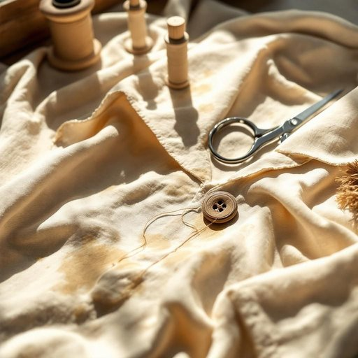

# button

<h1 style="font-size: 2.5em; font-weight: 300; letter-spacing: 2px; margin: 0; color: #2c3e50;">
/ˈbətən/
</h1>

---

---

## 例句

Could you please pass me the sewing kit on the kitchen table? I need to reattach the missing button from my favourite shirt, which I was wearing when I spilled tea on it during breakfast, and I want to make sure it’s securely fastened before I head out this afternoon.

*Could(/kʊd/) you(/ju/) please(/pliz/) pass(/pæs/) me(/mi/) the(/ðə/) sewing(/soʊɪŋ/) kit(/kɪt/) on(/ɔn/) the(/ðə/) kitchen(/ˈkɪʧən/) table?(/ˈteɪbəl?/) I(/aɪ/) need(/nid/) to(/tɪ/) reattach(/ˈriəˈtæʧ/) the(/ðə/) missing(/ˈmɪsɪŋ/) button(/ˈbətən/) from(/frəm/) my(/maɪ/) favourite(/ˈfeɪvərɪt/) shirt,(/ʃərt,/) which(/wɪʧ/) I(/aɪ/) was(/wɑz/) wearing(/ˈwɛrɪŋ/) when(/wɪn/) I(/aɪ/) spilled(/spɪld/) tea(/ti/) on(/ɔn/) it(/ɪt/) during(/ˈdʊrɪŋ/) breakfast,(/ˈbrɛkfəst,/) and(/ənd/) I(/aɪ/) want(/wɔnt/) to(/tɪ/) make(/meɪk/) sure(/ʃʊr/) it’s(/it’s*/) securely(/sɪˈkjʊrli/) fastened(/ˈfæsənd/) before(/ˌbiˈfɔr/) I(/aɪ/) head(/hɛd/) out(/aʊt/) this(/ðɪs/) afternoon.(/ˌæftərˈnun./)*

**翻译：** 请把厨房桌子上的缝纫包递给我好吗？我需要重新缝上我最喜欢的那件衬衫上掉落的纽扣。那件衬衫是我早餐时穿的，不小心洒了茶，我想确保纽扣牢固缝好，然后下午出门时放心些。

---

## 解释

英语单词“button”作为名词，在家居生活用品场景中主要指衣服上的“纽扣”，这是最常见和具体的使用场合。纽扣用于将衣服的两片布料固定在一起，常见于衬衫、外套、裤子等服装上，也是缝纫和服装制作的重要配件。英语学习者在使用“button”时需注意其单复数形式，单数为button，复数为buttons；此外，常见搭配有“sew on a button”（缝上纽扣）、“button up a coat”（把大衣扣上纽扣）、“loose button”（松开的纽扣）等表达，使用时动词搭配和介词选择尤为重要。同时，“button”也可以指电子设备上的按钮，但在家居生活用品的上下文中大多专指服装纽扣。该词源自中古英语“bouton”，源自古法语“bouton”，意为“芽、钮扣”，进一步追溯到拉丁语“bullire”，意指“冒泡、打结”，反映了纽扣的形状特点。在中文语境中，“button”准确翻译为“纽扣”，是一个中性词汇，无特别褒贬或文化负面含义，日常生活中极为常用且易于理解，学习者需注意不要混淆其电子按钮的意义，根据语境区分。

---

<small style="color: #999; font-size: 0.9em;">2025-07-27 09:14:04</small>

