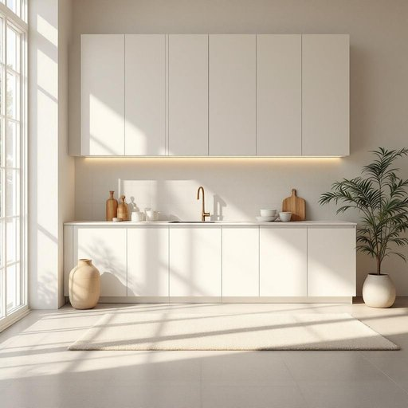

# cabinet

<h1 style="font-size: 2.5em; font-weight: 300; letter-spacing: 2px; margin: 0; color: #2c3e50;">
/ˈkæbənət/
</h1>

---

---

## 例句

Could you please check if the cabinet in the kitchen, which we've recently painted white to match the countertops and the new backsplash, has enough space left to store the extra set of dishes we bought last weekend for the dinner party?

*Could(/kʊd/) you(/ju/) please(/pliz/) check(/ʧɛk/) if(/ɪf/) the(/ðə/) cabinet(/ˈkæbənət/) in(/ɪn/) the(/ðə/) kitchen,(/ˈkɪʧən,/) which(/wɪʧ/) we've(/wiv/) recently(/ˈrisəntli/) painted(/ˈpeɪnɪd/) white(/waɪt/) to(/tɪ/) match(/mæʧ/) the(/ðə/) countertops(/ˈkaʊntərˌtɑps/) and(/ənd/) the(/ðə/) new(/nu/) backsplash,(/backsplash*,/) has(/həz/) enough(/ɪˈnəf/) space(/speɪs/) left(/lɛft/) to(/tɪ/) store(/stɔr/) the(/ðə/) extra(/ˈɛkstrə/) set(/sɛt/) of(/əv/) dishes(/ˈdɪʃɪz/) we(/wi/) bought(/bɔt/) last(/læst/) weekend(/ˈwiˌkɪnd/) for(/fər/) the(/ðə/) dinner(/ˈdɪnər/) party?(/ˈpɑrti?/)*

**翻译：** 请您帮忙确认一下厨房里那个我们最近刚粉刷成白色、与台面和新墙砖相配的橱柜，是否还有足够的空间来存放我们上周末为晚宴新购置的那套餐具？

---

## 解释

单词“cabinet”在家居生活用品的语境中作为名词，通常指带门或抽屉的储物柜，用于收纳物品，如厨房柜、浴室柜或办公室文件柜等，其使用场合多见于描述家具布置和家居环境。英语学习者使用该词时需注意其单数和复数形式分别为cabinet和cabinets，且常见搭配包括“kitchen cabinet”（厨房橱柜）、“medicine cabinet”（药柜）等。此外，cabinet可与名词搭配形成复合结构，以明确具体用途或位置。词源方面，cabinet来源于意大利语“cabinetto”，意为“小房间”或“密室”，后来演变为指小巧的储物家具。这反映了cabinet一词最初的空间隐秘性与储藏功能。在中文语境中，cabinet准确翻译为“橱柜”或“柜子”，强调其作为储藏家具的属性，没有明显褒贬含义，属于中性词汇。需注意的是，cabinet在其他语境中还有政治用法，如“内阁”，但在家居用品中一般指储物柜，不带其他文化色彩或隐含意义。

---

<small style="color: #999; font-size: 0.9em;">2025-07-27 09:14:04</small>

