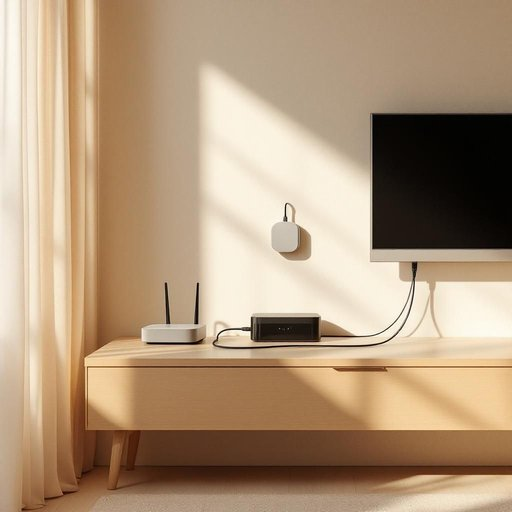

# cable

<h1 style="font-size: 2.5em; font-weight: 300; letter-spacing: 2px; margin: 0; color: #2c3e50;">
/ˈkeɪbəl/
</h1>

---

---

## 例句

Could you please check if the cable behind the television, which connects the box to the router and has been acting up intermittently for the past week, needs replacing, or if it might just be a loose connection causing the signal issues we've been experiencing?

*Could(/kʊd/) you(/ju/) please(/pliz/) check(/ʧɛk/) if(/ɪf/) the(/ðə/) cable(/ˈkeɪbəl/) behind(/bɪˈhaɪnd/) the(/ðə/) television,(/ˈtɛləˌvɪʒən,/) which(/wɪʧ/) connects(/kəˈnɛkts/) the(/ðə/) box(/bɑks/) to(/tɪ/) the(/ðə/) router(/ˈrutər/) and(/ənd/) has(/həz/) been(/bɪn/) acting(/ˈæktɪŋ/) up(/əp/) intermittently(/ˌɪntərˈmɪtəntli/) for(/fər/) the(/ðə/) past(/pæst/) week,(/wik,/) needs(/nidz/) replacing,(/rɪˈpleɪsɪŋ,/) or(/ər/) if(/ɪf/) it(/ɪt/) might(/maɪt/) just(/ʤɪst/) be(/bi/) a(/ə/) loose(/lus/) connection(/kəˈnɛkʃən/) causing(/ˈkɔzɪŋ/) the(/ðə/) signal(/ˈsɪgnəl/) issues(/ˈɪʃuz/) we've(/wiv/) been(/bɪn/) experiencing?(/ɪkˈspɪriənsɪŋ?/)*

**翻译：** 您能否帮忙检查一下电视后连接盒子和路由器的那根电缆，看看是否需要更换？这根电缆在过去一周时断时续地出现故障，不知道是不是线路松动导致信号问题？

---

## 解释

英语单词“cable”作为名词在家居生活用品场景中通常指用于连接电子设备或传输电力和信号的电缆、线缆，例如电视线缆、充电线、网络线等，常见于连接电脑、电视、电话或家用电器的情境中。学习者在使用“cable”时需要注意它多为可数名词，复数形式为“cables”，且常与动词“connect”、“plug in”、“unplug”等搭配，如“connect the cable to the TV”（将线缆连接到电视上）。此外，“cable”也能作为动词使用，表示“用电缆连接”，但在家居生活语境中，作为名词的使用更为普遍。该词源自古法语“cable”，再追溯到拉丁语“capulum”，意为“绳索”，最初指粗绳，后因技术发展指代传输电流或信号的铜线或光纤。中文中“cable”通常翻译为“电缆”或“线缆”，在家居环境下可根据具体用途译为“连接线”或“数据线”，表达准确且贴近使用场景。词义本身无褒贬或特殊文化色彩，属于中性、技术性词汇，使用时应结合具体设备或功能明确指代对象。

---

<small style="color: #999; font-size: 0.9em;">2025-07-27 09:14:04</small>

