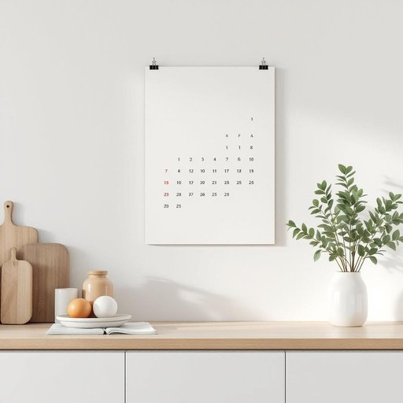

# calendar

<h1 style="font-size: 2.5em; font-weight: 300; letter-spacing: 2px; margin: 0; color: #2c3e50;">
/ˈkæləndər/
</h1>

---

---

## 例句

Could you please check the calendar hanging in the kitchen, which not only displays the dates but also features important family appointments and reminders, so we don’t miss the upcoming dentist visit and the school play next month?

*Could(/kʊd/) you(/ju/) please(/pliz/) check(/ʧɛk/) the(/ðə/) calendar(/ˈkæləndər/) hanging(/ˈhæŋɪŋ/) in(/ɪn/) the(/ðə/) kitchen,(/ˈkɪʧən,/) which(/wɪʧ/) not(/nɑt/) only(/ˈoʊnli/) displays(/dɪˈspleɪz/) the(/ðə/) dates(/deɪts/) but(/bət/) also(/ˈɔlsoʊ/) features(/ˈfiʧərz/) important(/ˌɪmˈpɔrtənt/) family(/ˈfæməli/) appointments(/əˈpɔɪntmənts/) and(/ənd/) reminders,(/riˈmaɪndərz,/) so(/soʊ/) we(/wi/) don’t(/don’t*/) miss(/mɪs/) the(/ðə/) upcoming(/ˈəpˌkəmɪŋ/) dentist(/ˈdɛntɪst/) visit(/ˈvɪzɪt/) and(/ənd/) the(/ðə/) school(/skul/) play(/pleɪ/) next(/nɛkst/) month?(/mənθ?/)*

**翻译：** 请您查看一下挂在厨房的日历，那里不仅标注了日期，还列出了重要的家庭约会和提醒，这样我们就不会错过即将到来的牙医预约和下个月的学校话剧演出。

---

## 解释

英语单词"calendar"作为名词，在家居生活用品场景中，通常指挂在墙上或摆放在桌面上的日历，用于记录和显示日期、星期及节假日，以方便日常时间管理和安排活动。这类日历可能是纸质的，也可能是电子屏显的，常见于家庭、办公环境等，帮助用户规划生活和工作时间。英语学习者在使用"calendar"时需注意其名词属性，多用作可数名词，常见搭配有"wall calendar"（挂墙日历）、"desk calendar"（桌面日历）、"monthly calendar"（月历）、"calendar year"（日历年）等，且"calendar"后可直接加特定时间段或类型构成短语，如"calendar month"。此外，日历的日期通常用"on the calendar"表达。词源方面，"calendar"源自拉丁语"calendarium"，原指罗马的账簿、记账本，后来引申为记录每月第一天（calends）的时间表，逐渐演变为现代意义的日期记录工具。在中文语境中，"calendar"准确翻译为“日历”，强调它作为日期和时间的工具性质，通常无贬义或褒义色彩，属于中性词汇，文化上与中国传统农历不同，英语语境中的calendar多指公历日历，使用时应区别于农历、节气等中国特色时间表达。

---

<small style="color: #999; font-size: 0.9em;">2025-07-27 09:14:04</small>

