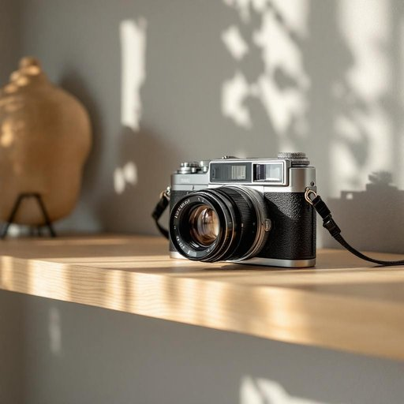

# camera

<h1 style="font-size: 2.5em; font-weight: 300; letter-spacing: 2px; margin: 0; color: #2c3e50;">
/ˈkæmərə/
</h1>

---

---

## 例句

While tidying up the living room, I found the old camera that we bought last year, the one with the detachable lens and built-in flash, tucked away behind the photo albums on the bookshelf, which reminded me of all those family holidays we captured so vividly before smartphones became our go-to device for snapping pictures.

*While(/waɪl/) tidying(/tidying*/) up(/əp/) the(/ðə/) living(/ˈlɪvɪŋ/) room,(/rum,/) I(/aɪ/) found(/faʊnd/) the(/ðə/) old(/oʊld/) camera(/ˈkæmərə/) that(/ðət/) we(/wi/) bought(/bɔt/) last(/læst/) year,(/jɪr,/) the(/ðə/) one(/wən/) with(/wɪθ/) the(/ðə/) detachable(/dɪˈtæʧəbəl/) lens(/lɛnz/) and(/ənd/) built-in(/ˈbɪlˌtɪn/) flash,(/flæʃ,/) tucked(/təkt/) away(/əˈweɪ/) behind(/bɪˈhaɪnd/) the(/ðə/) photo(/ˈfoʊˌtoʊ/) albums(/ˈælbəmz/) on(/ɔn/) the(/ðə/) bookshelf,(/ˈbʊkˌʃɛlf,/) which(/wɪʧ/) reminded(/riˈmaɪndɪd/) me(/mi/) of(/əv/) all(/ɔl/) those(/ðoʊz/) family(/ˈfæməli/) holidays(/ˈhɑləˌdeɪz/) we(/wi/) captured(/ˈkæpʧərd/) so(/soʊ/) vividly(/ˈvɪvədli/) before(/ˌbiˈfɔr/) smartphones(/smartphones*/) became(/bɪˈkeɪm/) our(/ɑr/) go-to(/go-to*/) device(/dɪˈvaɪs/) for(/fər/) snapping(/sˈnæpɪŋ/) pictures.(/ˈpɪkʧərz./)*

**翻译：** 整理客厅时，我发现了去年买的那台老相机——带可拆卸镜头和内置闪光灯的那款，藏在书架上相册后面。这让我想起了智能手机成为我们拍照首选之前，那些我们曾经生动记录的家庭假期。

---

## 解释

英语单词“camera”作为名词在家居生活用品的语境中，通常指的是用于拍摄照片或录像的设备，如数码相机、手机摄像头或监控摄像头，常见于家庭内部或周围环境的安装和使用场合，例如客厅摆放的数码相机、厨房中的智能摄像头、安全监控系统等。“camera”作为单词使用时应注意其可数名词属性，前面需使用冠词（a camera，the camera）或数量词（two cameras），且在表示复数时需加复数形式“cameras”。常见搭配包括“digital camera”（数码相机）、“security camera”（监控摄像头）、“web camera”或“webcam”（网络摄像头）等，表达时需根据具体功能选择合适的形容词修饰。该词源自拉丁语“camera”，意为“房间”或“密室”，后来引申为带有光学成像装置的暗箱，最终演变为现代意义上的照相机。中文语境中，“camera”准确翻译为“相机”或“摄像机”，依据具体功能有所不同，但在家庭生活中一般指的是“相机”或“摄像头”，用于捕捉静态图片或动态视频。需注意“camera”在日常用语中没有明显的褒贬色彩，属于中性名词，文化含义上反映了现代家庭对影像记录和安全监控的普遍需求和技术应用。

---

<small style="color: #999; font-size: 0.9em;">2025-07-27 09:14:04</small>

